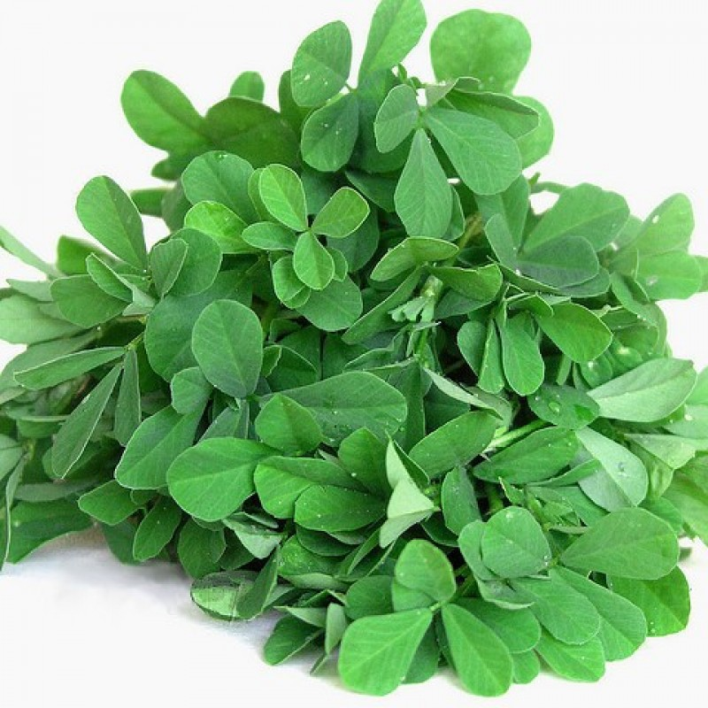
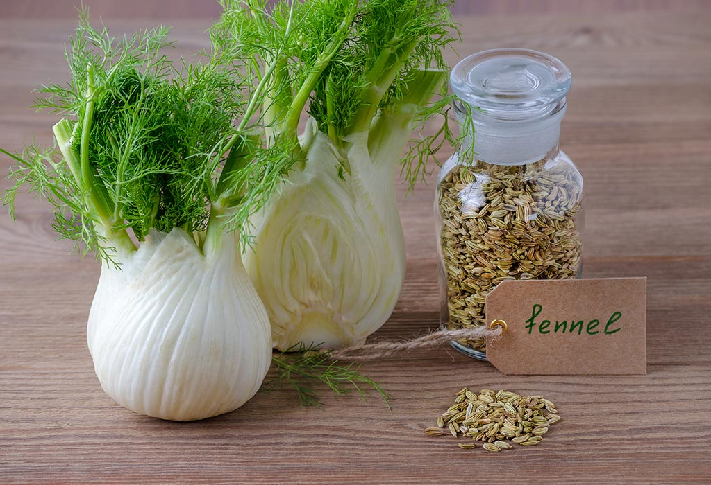

===============
Leaf Herbals
===============

Tulsi(Holy basil)::

    The three main morphotypes cultivated in India and Nepal are Ram tulsi (the most common type,
    with broad bright green leaves that are slightly sweet leaves),
    the less common purplish green-leaved (Krishna tulsi) and the common wild "vana tulsi".

.. image:: ../../../images/agriculture/plants/Herbals/tulsi.jpg

Basil::

  Basil (ocimum basilicum) is a common herb used to garnish salads, pasta and many other meals to add delicious flavor.
  Health Benefits:

  Reduces stress
  Strong antibacterial properties
  Rich source of antioxidants
  Prevents some harmful effects of aging
  Reduces inflammation and swelling
  Strengthens bones and liver
  Boosts immunity
  Boosts metabolism
  Improves digestion

.. image:: ../../../images/agriculture/plants/Herbals/basil.jpg

Mint::

    Mentha (also known as mint, from Greek μίνθα míntha, Linear B mi-ta[3]) is a genus of plants in the family
    Lamiaceae (mint family).The exact distinction between species is unclear; it is estimated that 13 to 24 species exist.
    Hybridization occurs naturally where some species range overlap. Many hybrids and cultivars are known.

.. image:: ../../../images/agriculture/plants/Herbals/mint.jpg

Thyme::

    Thyme (/taɪm/) is any member of the genus Thymus of aromatic perennial evergreen herbs in the mint family Lamiaceae.
    Thymes are relatives of the oregano genus Origanum. They have culinary, medicinal, and ornamental uses, and the
    species most commonly cultivated and used for culinary purposes is Thymus vulgaris.

.. image:: ../../../images/agriculture/plants/Herbals/thyme.jpg

Fenugreek(Methi)::

Fennel(saumph)::

Coriander(Dhania)::

.. image:: ../../../images/agriculture/plants/Herbals/coriender.jpg

Ginger(Adrakh)::

.. image:: ../../../images/agriculture/plants/Herbals/ginger.jpg

Echinacea::

Catnip::

    Catnip health benefits:

    Repels bugs and relieves irritation from bug bites
    Calms restlessness, anxiety and stress
    Relieves stomach discomfort
    Accelerates recovery from colds and fevers

    Common uses:

    Brew leaves for a tea
    Dry leaves and burn to release aroma
    Apply essential oils or leaves topically

