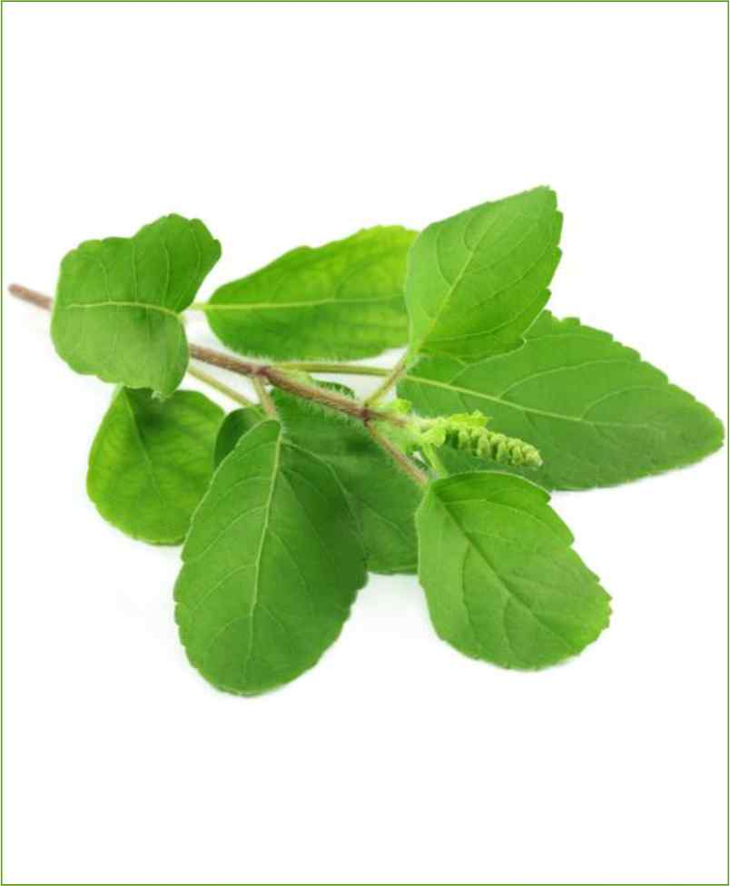
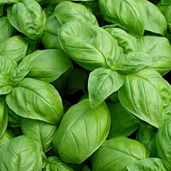
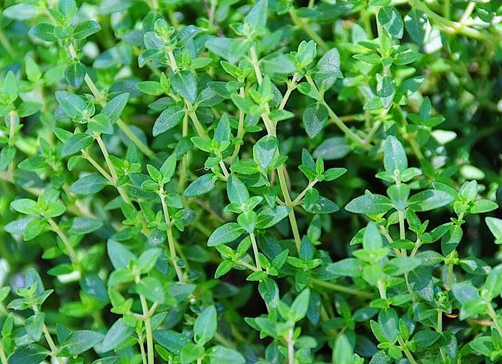
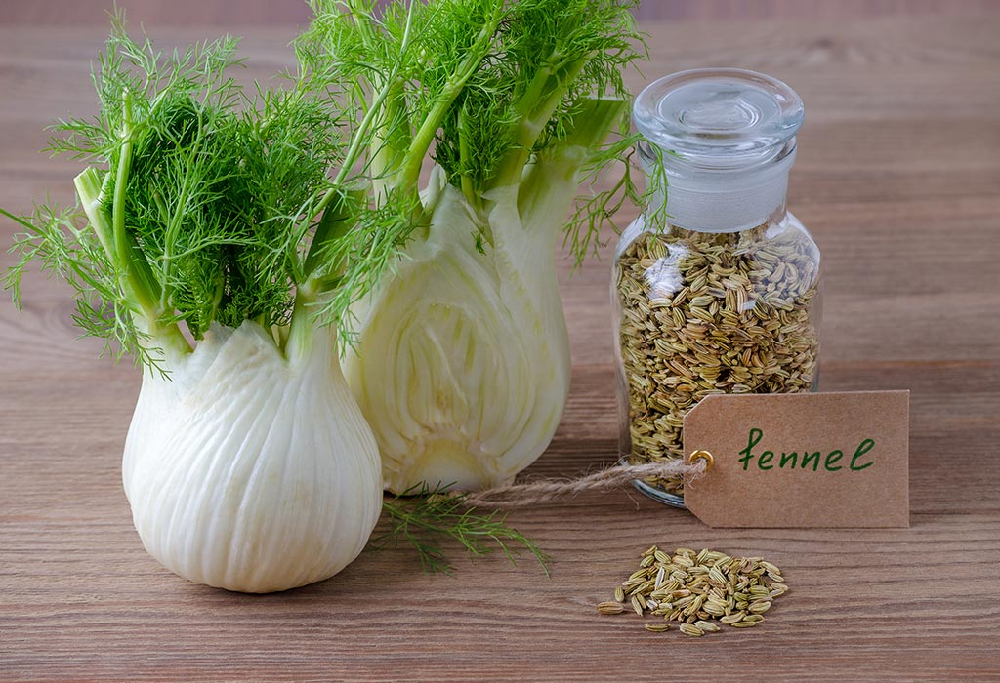
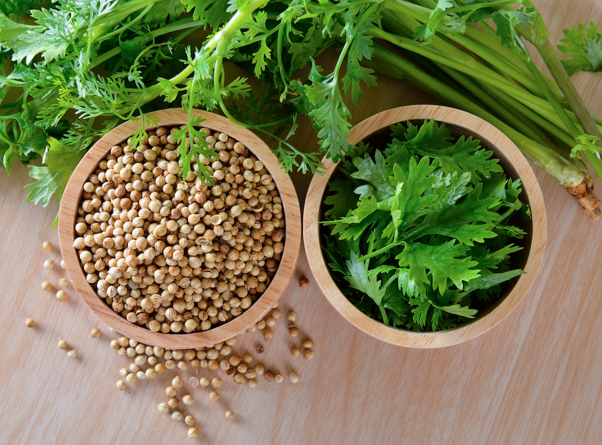
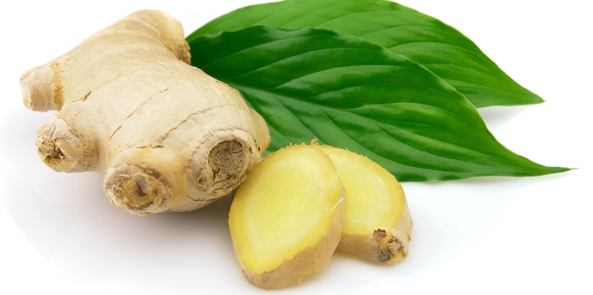
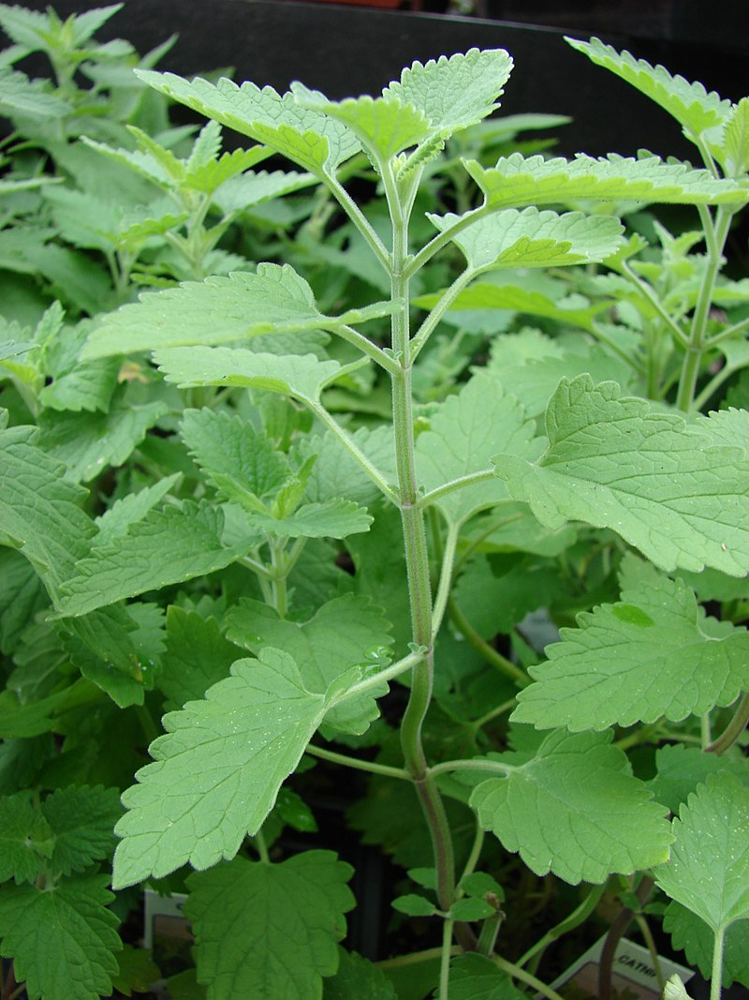

===============
Leaf Herbals
===============

Tulsi(Holy basil)::

    The three main morphotypes cultivated in India and Nepal are Ram tulsi (the most common type,
    with broad bright green leaves that are slightly sweet leaves),
    the less common purplish green-leaved (Krishna tulsi) and the common wild "vana tulsi".

Basil::

  Basi  l (ocimum basilicum) is a common herb used to garnish salads, pasta and many other meals to add delicious flavor.
  Health Benefits:

  Reduces stress
  Strong antibacterial properties
  Rich source of antioxidants
  Prevents some harmful effects of aging
  Reduces inflammation and swelling
  Strengthens bones and liver
  Boosts immunity
  Boosts metabolism
  Improves digestion

Mint::

    Mentha (also known as mint, from Greek μίνθα míntha, Linear B mi-ta[3]) is a genus of plants in the family
    Lamiaceae (mint family).The exact distinction between species is unclear; it is estimated that 13 to 24 species exist.
    Hybridization occurs naturally where some species range overlap. Many hybrids and cultivars are known.

.. image:: ../../../images/agriculture/plants/Herbals/mint.jpg
   :height: 400px
   :width:  400 px
   :scale: 100 %

Thyme::

    Thyme (/taɪm/) is any member of the genus Thymus of aromatic perennial evergreen herbs in the mint family Lamiaceae.
    Thymes are relatives of the oregano genus Origanum. They have culinary, medicinal, and ornamental uses, and the
    species most commonly cultivated and used for culinary purposes is Thymus vulgaris.

Fennel(saumph)::

    Florence fennel is one of the three main herbs used in the preparation of absinthe, an alcoholic mixture which
    originated as a medicinal elixir in Europe and became, by the late 19th century, a popular alcoholic drink in
    France and other countries.Fennel fruit is also used in the production of akvavit

Coriander(Dhania)::

    Coriander (/ˌkɒriˈændər, ˈkɒriændər/;[1] Coriandrum sativum) is an annual herb in the family Apiaceae.
    It is also known as Chinese parsley, and in the United States the stems and leaves are usually called
    cilantro (/sɪˈlæntroʊ, -ˈlɑːn-/).[2] All parts of the plant are edible, but the fresh leaves and the
    dried seeds (as a spice) are the parts most traditionally used in cooking

Ginger(Adrakh)::

    Ginger (Zingiber officinale) is a flowering plant whose rhizome, ginger root or ginger, is widely used as
    a spice and a folk medicine.[2] It is a herbaceous perennial which grows annual pseudostems
    (false stems made of the rolled bases of leaves) about one meter tall bearing narrow leaf blades.
    The inflorescences bear pale yellow with purple flowers and arise directly from the rhizome on separate shoots.

Echinacea::

    Echinacea /ˌɛkɪˈneɪʃiə/[1] is a genus, or group of herbaceous flowering plants in the daisy family.
    The genus Echinacea has ten species, which are commonly called coneflowers.
    They are found only in eastern and central North America, where they grow in moist to dry prairies
    and open wooded areas

Catnip::

    Nepeta cataria, commonly known as catnip, catswort, catwort, and catmint, is a species of the genus Nepeta
    in the family Lamiaceae, native to southern and eastern Europe, the Middle East, Central Asia, and parts of China.
    It is widely naturalized in northern Europe, New Zealand, and North America.
    The common name catmint can also refer to the genus as a whole.

    Catnip health benefits:

    Repels bugs and relieves irritation from bug bites
    Calms restlessness, anxiety and stress
    Relieves stomach discomfort
    Accelerates recovery from colds and fevers

    Common uses:

    Brew leaves for a tea
    Dry leaves and burn to release aroma
    Apply essential oils or leaves topically

