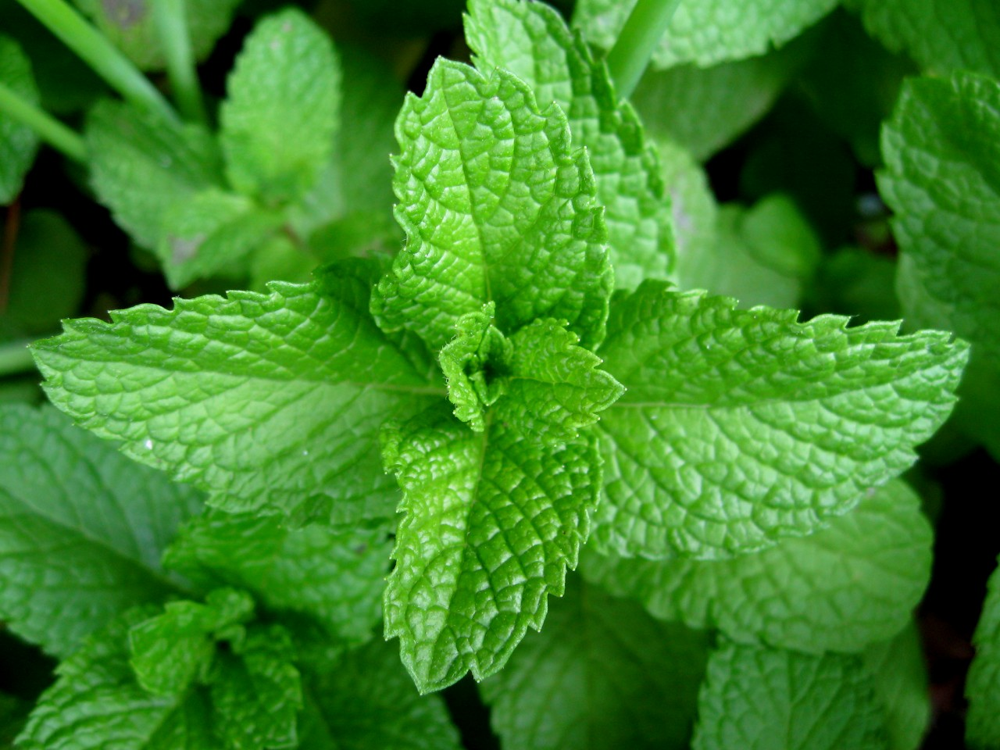

===============
Leaf Herbals
===============

Tulsi(Holy basil)::

.. image:: ../../../images/agriculture/plants/Herbals/tulsi.jpg

Basil::

  Basil (ocimum basilicum) is a common herb used to garnish salads, pasta and many other meals to add delicious flavor.
  Health Benefits:

  Reduces stress
  Strong antibacterial properties
  Rich source of antioxidants
  Prevents some harmful effects of aging
  Reduces inflammation and swelling
  Strengthens bones and liver
  Boosts immunity
  Boosts metabolism
  Improves digestion

Mint::

.. image:: ../../../images/agriculture/plants/Herbals/basil.jpg

Fenugreek::

Fennel::

Coriander::

Ginger::

Echinacea::

Catnip::

    Catnip health benefits:

    Repels bugs and relieves irritation from bug bites
    Calms restlessness, anxiety and stress
    Relieves stomach discomfort
    Accelerates recovery from colds and fevers

    Common uses:

    Brew leaves for a tea
    Dry leaves and burn to release aroma
    Apply essential oils or leaves topically

