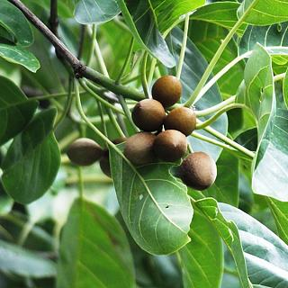
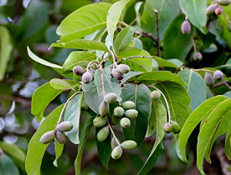
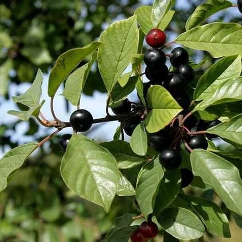
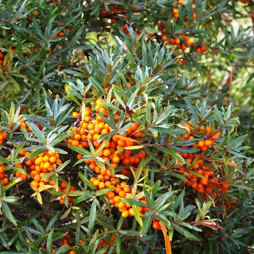
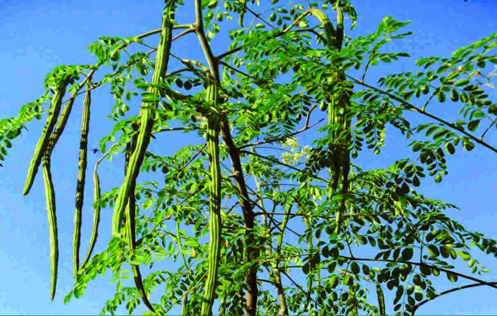

===============
Tree Herbals
===============

Gingko::

    Ginkgo biloba, commonly known as ginkgo or gingko, also known as the maidenhair tree,
    is the only living species in the division Ginkgophyta, all others being extinct.
    Benefits::
    dementia
    Alzheimer’s disease
    eye health
    inflammation
    diabetes
    bone healing
    anxiety
    depression

.. image:: ../../../images/agriculture/plants/Herbals/ginkgo.jpg
   :height: 400px
   :width:  400 px
   :scale: 100 %

Neem::

    Azadirachta indica, commonly known as neem, nimtree or Indian lilac,[3] is a tree in the mahogany family Meliaceae.
    It is one of two species in the genus Azadirachta, and is native to the Indian subcontinent. It is typically grown
    in tropical and semi-tropical regions

.. image:: ../../../images/agriculture/plants/Herbals/neem.jpg
   :height: 400px
   :width:  400 px
   :scale: 100 %

Amla::

    Phyllanthus emblica, also known as emblic, emblic myrobalan,myrobalan, Indian gooseberry,Malacca tree, or amla from
    Sanskrit amalaki is a deciduous tree of the family Phyllanthaceae.It has edible fruit,referred to by the same name.

.. image:: ../../../images/agriculture/plants/Herbals/amla.jpg
   :height: 400px
   :width:  400 px
   :scale: 100 %

Bael::

   Aegle marmelos L., commonly known as bael (or bili or bhel), also Bengal quince, golden apple, Japanese
   bitter orange, stone apple or wood apple, is a species of tree native to the Indian subcontinent and Southeast Asia.

.. image:: ../../../images/agriculture/plants/Herbals/bael.jpg
   :height: 400px
   :width:  400 px
   :scale: 100 %

Bahera::

    Terminalia bellirica, known as bahera or beleric or bastard myrobalan, (Arabic: beliledj بليلج,[1] Sanskrit:
    Bibhitaka बिभीतक,[2] Aksha अक्ष[3]), is a large deciduous tree

Haritaki::

    Terminalia chebula, commonly known as black- or chebulic myrobalan,[2] is a species of Terminalia, native to
    South Asia from India and Nepal east to southwest China (Yunnan), and south to Sri Lanka, Malaysia, and Vietnam.

FragulaAlnus::

    Frangula alnus, commonly known as alder buckthorn, glossy buckthorn, or breaking buckthorn, is a tall deciduous
    shrub in the family Rhamnaceae. Unlike other "buckthorns", alder buckthorn does not have thorns.

Hippophae rhamnoides::

    Hippophae rhamnoides, also known as sea-buckthorn[1]:277 is a species of flowering plant in the family Elaeagnaceae,
    native to the cold-temperate regions of Europe and Asia

Drumstick::

    Moringa oleifera is a fast-growing, drought-resistant tree of the family Moringaceae, native to the Indian
    subcontinent.[2] Common names include moringa,[3] drumstick tree[3] (from the long, slender, triangular seed-pods),
    horseradish tree

