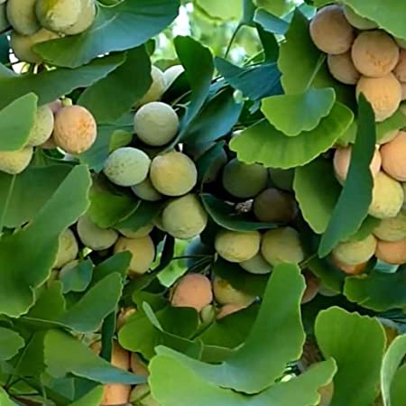
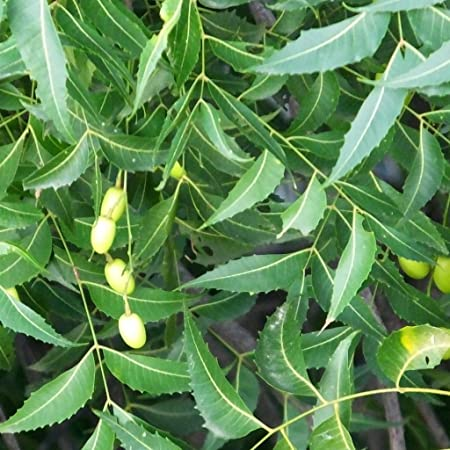
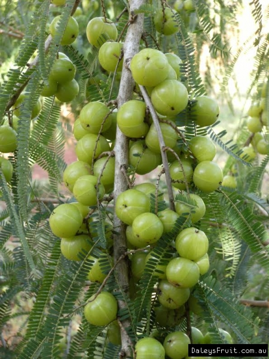
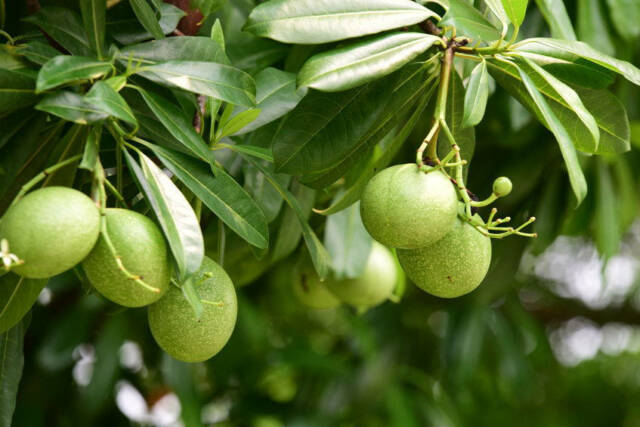

===============
Tree Herbals
===============

Gingko::

    Ginkgo biloba, commonly known as ginkgo or gingko, also known as the maidenhair tree,
    is the only living species in the division Ginkgophyta, all others being extinct.

Neem::

    Azadirachta indica, commonly known as neem, nimtree or Indian lilac,[3] is a tree in the mahogany family Meliaceae.
    It is one of two species in the genus Azadirachta, and is native to the Indian subcontinent. It is typically grown
    in tropical and semi-tropical regions

Amla::

    Phyllanthus emblica, also known as emblic, emblic myrobalan,myrobalan, Indian gooseberry,Malacca tree, or amla from
    Sanskrit amalaki is a deciduous tree of the family Phyllanthaceae.It has edible fruit,referred to by the same name.

Bael::

   Aegle marmelos L., commonly known as bael (or bili or bhel), also Bengal quince, golden apple, Japanese
   bitter orange, stone apple or wood apple, is a species of tree native to the Indian subcontinent and Southeast Asia.

