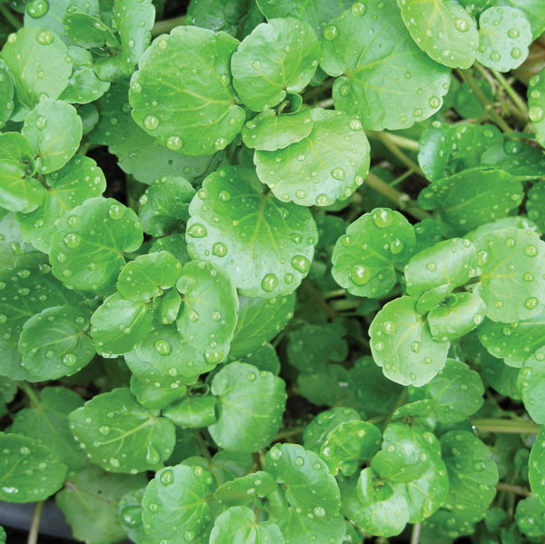

==================
Leaf Vegitables
==================

Arugula::

    Arugula is known as Eruca vesicaria and Wild rocket.is an edible annual plant in the
    family Brassicaceae used as a leaf vegetable for its fresh, tart, bitter, and peppery flavor.
    In Eastern Saudi Arabia it is widely believed the plant has a lot of health benefits and
    recommended for newlywed couples.

    Health benefits:
    These include:

    Calcium:    which helps the blood to clot normally. It’s also necessary for bone health, tooth health,
                muscle function, and nerve function.
    Potassium:  a mineral and an electrolyte that’s vital for heart and nerve function. It also helps the muscles contract normally.
                Potassium helps to reduce the negative effects of sodium, and it may be beneficial for people with high blood pressure for this reason.
    Folate, a B vitamin: It helps support the production of DNA and other genetic material. It’s particularly important for women who are pregnant
                 or planning to become pregnant. Folate deficiency in pregnant women may lead to spina bifida, a neural tube defect.
    Vitamin C:  a powerful antioxidant that helps support the immune system. Also known as ascorbic acid.
                vitamin C is important for tissue health and the absorption of iron from food.
    Vitamin K:  which helps with blood coagulation. If you require a prescription blood thinner,
                such as warfarin (Coumadin), discuss your vitamin K intake with your doctor prior to changing your eating habits.
    Vitamin A:  the umbrella term for a group of fat-soluble retinoids. Vitamin A is a powerful antioxidant,
                which supports immune function, cell growth, night vision, and overall eye health.
                It also works to help maintain kidney, lung, and heart function.

.. image:: ../../../images/agriculture/plants/salads/arugula.jpg
   :height: 400px
   :width:  400 px
   :scale: 100 %

Kale::

    Kale (/keɪl/), or leaf cabbage, belongs to a group of cabbage (Brassica oleracea) cultivars grown for their edible leaves, although some are used as ornamentals.
    The ultimate origin is Latin caulis 'cabbage'.

    Health benefits:
    These include:
    A single cup of raw kale (about 67 grams or 2.4 ounces) contains (1):
    Vitamin A: 206% of the DV (from beta-carotene)
    Vitamin K: 684% of the DV
    Vitamin C: 134% of the DV
    Vitamin B6: 9% of the DV
    Manganese: 26% of the DV
    Calcium: 9% of the DV
    Copper: 10% of the DV
    Potassium: 9% of the DV
    Magnesium: 6% of the DV
    It also contains 3% or more of the DV for vitamin B1 (thiamin), vitamin B2 (riboflavin),
    vitamin B3 (niacin), iron and phosphorus
    This is coming with a total of 33 calories, 6 grams of carbs (2 of which are fiber) and 3 grams of protein.

Watercress::

    Watercress or yellowcress is an aquatic plant species with the botanical name Nasturtium officinale.
    Health benefits:
    These include:
    One cup (34 grams) of watercress contains the following (3):
    Calories: 4
    Carbs: 0.4 grams
    Protein: 0.8 grams
    Fat: 0 grams
    Fiber: 0.2 grams
    Vitamin A: 22% of the Reference Daily Intake (RDI)
    Vitamin C: 24% of the RDI
    Vitamin K: 106% of the RDI
    Calcium: 4% of the RDI
    Manganese: 4% of the RDI

Spinach::

    Spinach (Spinacia oleracea) is a leafy green flowering plant native to central and western Asia.
    It is of the order Caryophyllales, family Amaranthaceae, subfamily Chenopodioideae.
    Its leaves are a common edible vegetable consumed either fresh
    The nutrition facts for 3.5 ounces (100 grams) of raw spinach are (1Trusted Source):

    Calories: 23
    Water: 91%
    Protein: 2.9 grams
    Carbs: 3.6 grams
    Sugar: 0.4 grams
    Fiber: 2.2 grams
    Fat: 0.4 grams
.. image:: ../../../images/agriculture/plants/salads/spinach.jpg
   :height: 400px
   :width:  400 px
   :scale: 100 %

Valerianella locusta(Corn salad)::

    Valerianella locusta is a small annual plant that is eaten as a leaf vegetable.
    It has a characteristic nutty flavour, dark green colour, and soft texture,
    and is popularly served as salad greens.[2] Common names include corn salad,
    common cornsalad,lamb's lettuce, mâche , fetticus, feldsalat, nut lettuce, field salad.

    Health Benefits:
    56 grams of raw Mache contains
    12 calories,
    1.12 grams of protein,
    0.22 grams of total fat and
    2.02 grams of carbohydrate.

    21.4 mg of Vitamin C,
    1.22 mg of Iron,
    0.153 mg of Vitamin B6,
    0.201 mg of Manganese,
    0.075 mg of Copper
    257 mg of Potassium.

.. image:: ../../../images/agriculture/plants/salads/corn-salads.jpg
   :height: 400px
   :width:  400 px
   :scale: 100 %