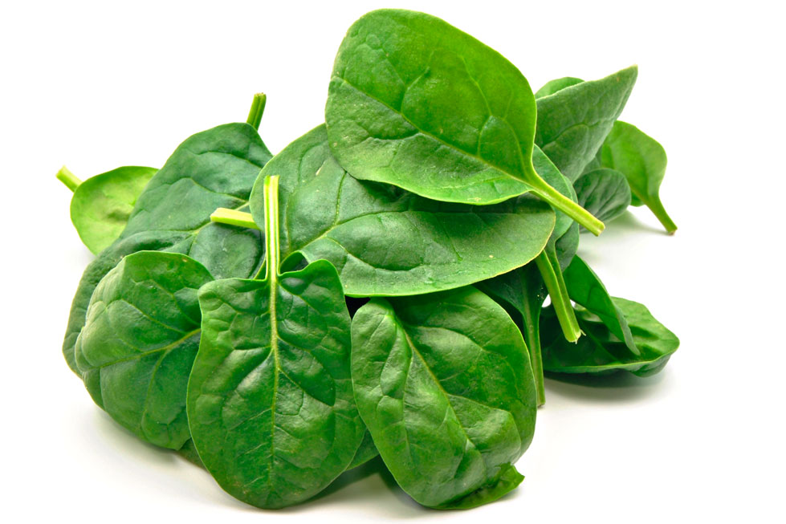

==================
Leaf Vegitables
==================

All data collected from:https://www.ars.usda.gov/

Arugula::

    Arugula is known as Eruca vesicaria and Wild rocket.is an edible annual plant in the
    family Brassicaceae used as a leaf vegetable for its fresh, tart, bitter, and peppery flavor.
    In Eastern Saudi Arabia it is widely believed the plant has a lot of health benefits and
    recommended for newlywed couples.
    Scinticic Name: Eruca sativa
    Common Name: Rocket, Roquette,Rucola, Garden rocket,Rocket,Eruca,Rocket Salad,Arrugula,Gargeer,Roka,Rugula and Tira

.. csv-table:: 100G
   :header: "Nutrition", "Amount"
   :widths: 40, 40

   "Water", "91.71 g"
   "Protein", "2.58g"
   "Energy","25	kcal"
   "fat", "0.66g"
   "Calcium", "0.56"

Kale::

    Kale (/keɪl/), or leaf cabbage, belongs to a group of cabbage (Brassica oleracea) cultivars grown for their edible leaves, although some are used as ornamentals.
    The ultimate origin is Latin caulis 'cabbage'.
    Common Name:Borecole, non-heading cabbage and broccoli.
    botanical name is Brassica oleracea.

    Nutrition Facts:
    130 gram of kale cooked offers
    1062.1 µg of Vitamin K,
    885 µg of Vitamin A,
    53.3 mg of Vitamin C,
    0.541 mg of Manganese,
    0.203 mg of Copper,
    1.17 mg of Iron,
    0.179 mg of Vitamin B6
    94 mg of Calcium.

    Amino acids like

    0.03 g of Tryptophan,
    0.11 g of Threonine,
    0.148 g of Isoleucine,
    0.173 g of Leucine,
    0.148 g of Lysine and
    0.023 g of Methionine

     Health benefits:
     Prevents inflammation and builds healthy bones: vitamin K
     Beneficial for Skin: The retinoid in vitamin A prevent the inflammation of acne
     Help prevent cancer:
     Prevent gout and kidney stones:
     Reduce the Risk of Heart Disease:
     Protect the Eyes:
     Help to Lose Weight:
     Loaded with Antioxidant:

.. image:: ../../../images/agriculture/plants/salads/kale.jpg
   :height: 400px
   :width:  400 px
   :scale: 100 %

Watercress::

    Watercress or yellowcress is an aquatic plant species with the botanical name Nasturtium officinale.

    Nutrition Facts:
    One cup of Watercress also provides
    0.03 gram of fat,
    0.78 gram of protein
    0.44 grams of carbohydrate (including 0.07 grams of sugar and 0.2 grams of fiber).
    70.83% of Vitamin K,
    16.22% of Vitamin C,
    7.71% of Vitamin A,
    4.10% of Calcium,
    3.61% of Manganese,
    2.38% of Potassium
    2.27% of Vitamin E as well as thiamin,vitamin B6, riboflavin, phosphorus and magnesium

    Health benefits:
    Eliminates carcinogens:Watercress helps to detoxify the environmental toxicants and carcinogens
                           which are found in the cigarette
    Prevent breast cancer:
    Colorectal cancer:if It was seen when the folate was intake for more than 15 years.
    Thyroid ailments:
    Prevent cardiovascular conditions:
    Strong bones:
    Folate:
    Antidepressant activity:
    Prevent strokes:
    Healthy pregnancy:
    Cognitive health:
    Brain health:
    Cures common cold:
    Treats asthma:

.. image:: ../../../images/agriculture/plants/salads/watercress.jpg
   :height: 400px
   :width:  400 px
   :scale: 100 %

Spinach::

    Spinach (Spinacia oleracea) is a leafy green flowering plant native to central and western Asia.
    It is of the order Caryophyllales, family Amaranthaceae, subfamily Chenopodioideae.
    Its leaves are a common edible vegetable consumed either fresh
    Nutrition Facts:
    30 grams (1 cup) of Spinach contains
    0.86 grams of protein,
    0.12 grams of fat
    1.09 grams of carbohydrates .
    The same amount serves
    8.4 mg of Vitamin C,
    0.057 mg of Riboflavin,
    0.023 mg of Thiamin and
    0.217 mg of Niacin. About
    30 mg of Calcium,
    0.81 mg of Iron,
    15 mg of Phosphorus,
    167 mg of Potassium
    24 mg of Sodium

    Health Benefits:
    Eye ailments: It prevents from the deficiency of Vitamin A
    Age related disease:Retinitis pigmentosa or AMD is a kind of blindness which is caused due to the decline of
                        lutein and xanthene that forms a central part of retina
    Neural functions:Spinach possess folate, potassium and various antioxidants
                      which helps to provide neurological advantages
    Reduces blood pressure: Spinach is low in sodium and rich in potassium
    Supports muscles: Factor C0-Q10 is an antioxidant which is found in Spinach that helps to strengthen
                      heart muscles that pump the blood continuously to all parts of body
    Bones: Vitamin K helps to retain calcium in the bone matrix that results in bone mineralization
    Treats ulcers:
    Metabolic functions:
    Prevent strokes:
    Anti-inflammation:
    Anti-cancer activity:
    Protects skin:
    Growth of infants:

Valerianella locusta(Corn salad)::

    Valerianella locusta is a small annual plant that is eaten as a leaf vegetable.
    It has a characteristic nutty flavour, dark green colour, and soft texture,
    and is popularly served as salad greens.

    Common Names: Mache,European corn salad, Fetticus, Lamb’s lettuce, Feldsalat, Common corn salad,
                  Field salad, Nut lettuce, Italian corn salad and Field lettuce

    Nutrition Facts:
    56 grams of raw Mache contains
    12 calories,
    1.12 grams of protein,
    0.22 grams of total fat and
    2.02 grams of carbohydrate.

    21.4 mg of Vitamin C,
    1.22 mg of Iron,
    0.153 mg of Vitamin B6,
    0.201 mg of Manganese,
    0.075 mg of Copper
    257 mg of Potassium.

    Health Benefits:
    Vision:Vitamin A
    Enhance immunity: Vitamin A enhances the immunity functions against infections by raising
                      lymphocytic responses against antigens.
    Treats hypertension: Vitamin C helps to lowers the blood pressure in the body
    Skin health:  Vitamin C helps to lower the appearance of wrinkles, skin dryness
    Pregnancy:  The deficiency of iron increases the chances of premature birth and underweight newborn(Iron supplements)
    Formation of hemoglobin:  Iron provides dark red shade to the blood
    Metabolism:  Vitamin B6 has the ability to metabolize nutrients to extract the energy.

Sorrel::

    Common sorrel or garden sorrel (Rumex acetosa), often simply called sorrel, is a perennial herb in the
    family Polygonaceae.Other names for sorrel include spinach dock and narrow-leaved dock.[citation needed]
    It is a common plant in grassland habitats and is cultivated as a garden herb or salad vegetable (pot herb).
    Common Names: common sorrel, garden sorrel, Bladder dock, Rosy Dock, ambari, sorrel, bubble dock,
                  spinach dock and narrow leaved dock
    Nutrition Facts:
    Just one cup (133 grams) of sorrel contains:
    29 calories
    0.9 gram fat
    4.3 grams carbohydrates
    2.7 grams protein
    3.9 grams fiber
    63.8 grams vitamin C (71 percent DV)
    137 milligrams magnesium (33 percent DV)
    266 micrograms vitamin A (30 percent DV)
    0.5 milligrams manganese (20 percent DV)
    0.2 milligrams copper (19 percent DV)
    3.2 milligrams iron (18 percent DV)
    519 milligrams potassium (11 percent DV)
    0.2 milligram vitamin B6 (10 percent DV)
    0.1 millligrams riboflavin (10 percent DV)
    84 millligrams phosphorus (7 percent DV)
    59 milligrams calcium (5 percent DV)

    Health Benefits:
    Reduces Mucus :because it contains tannins
    Helps Fight Cancer: high vitamin A(Sheep sorrel has been known about for over a hundred years as a
                         cancer-fighting herb and is believed to be “the main cancer-killing herb” in Essiac.
    Improves Sinus Infections: As a high-antioxidant herb, especially its high vitamin C content,
                               it’s awesome at reducing swelling and providing pain relief.
    Soothes Canker Sores:
    Equalizes Blood Pressure:
    Treats coughs:
    Remedies asthma & bronchitis.

Butterhead lettuce::

    Butterhead lettuce gets its name from its characteristically soft, buttery leaves.
    It’s also known as cabbage lettuce due to its round shape.
    The most popular types of butterhead are Bibb and Boston lettuce.

    Nutrition Fact:
    100 grams offering
    Calories: 13
    Protein: 1.5 grams
    Fiber: 1 gram
    Folate: 18% of the DV
    Iron: 8% of the DV
    Manganese: 8% of the DV
    Potassium: 5% of the DV
    Vitamin A: 18% of the DV
    Vitamin C: 4% of the DV
    Vitamin K: 85% of the DV

Hop Shoot::

     Hops are the flowers (also called seed cones or strobiles) of the hop plant Humulus lupulus,
     a member of the Cannabaceae family of flowering plants.[2] They are used primarily as a bittering,
     flavouring, and stability agent in beer, to which, in addition to bitterness, they impart floral,
     fruity, or citrus flavours and aromas.[3] Hops are also used for various purposes in other
     beverages and herbal medicine.

