==================
Assignment1
==================
Assignment 1: Basic data analysis and simulating probability distributions
In this assignment, you will first analyse some real estate data, and then simulate some random processes corresponding to common statistical distributions and models.
Work in groups of two or three and solve the tasks described below. Write a short report containing your answers, including the plots and create a zip file containing
the report and your Python code. Alternatively, write a Jupyter notebook including your code, plots, and comments. Submit your solution through this page
(click "Submit Assignment" in the top right).

Deadline: November 13

Didactic purpose of this assignment:

practice some basic analysis of numerical data, using statistical libraries in Python,
get a gut feeling for the scenarios underlying some of the most common models used in statistics and data science;
get some experience in generating synthetic data by simulating in (simplified) models.
References
In Lecture 1, we saw how to plot histograms and compute basic descriptive statistics, and simulate some simple random processes.
Matplotlib reference documentation (Links to an external site.).
Pandas reference documentation (Links to an external site.).
NumPy random documentation (Links to an external site.).

Part 1: Real estate prices
HerePreview the document is a CSV (comma-separated values) file listing real estate sales in England between 1995 and 2016. (Actually, to make things a bit faster it's only a subset.)

1)Load the CSV file into Python. Use the Pandas function read_csv or use one of the techniques you learned in the course Introduction to Data Science.

Solution Q1::

	import pandas as pd
    import matplotlib.pyplot as plt  # basic plotting library
    import seaborn as sns  # additional plotting functions
    import scipy
    import numpy as np
    import scipy.stats as stats
    from sklearn.cluster import KMeans

    url = 'http://www.cse.chalmers.se/~richajo/dit862/houses.csv'
    data = pd.read_csv(url, header=None, usecols=[0, 1, 2, 13], names=['Id', 'price', 'date', 'location'])
    data.head()
 OUT:
    	Id	                                    price	 date	            location
    0	{02A6460F-C1F3-4977-B7ED-2A77C79302AE}	52000	2001-12-07 00:00	DERBYSHIRE
    1	{5EEB0C41-09F5-4BDF-A73E-A4E72E20BFC4}	57000	2003-09-12 00:00	WEST MIDLANDS
    2	{09975216-3588-418C-B6C5-A5704B0E77DE}	69500	2005-12-21 00:00	GREATER MANCHESTER
    3	{44CB83B9-0EC3-48D4-9B8D-B34D13D3C09E}	84000	2001-01-31 00:00	SWINDON
    4	{74828706-CBFC-406D-B7B6-394B5863E22E}	110000	1998-02-27 00:00	OXFORDSHIRE

2)The second column in the CSV file represents the price of the property. Compute basic descriptive statistics about the prices in the whole dataset: mean, median, standard deviation, minimum, and maximum.
Solution Q2::

    def header(msg):
    print('-' * 50)
    print(' [ ' + msg + ' ] ')

    def value(msg, value):
    print(msg + ':', value)

    # **************************************************************************
    # Mean Calculation:
    # **************************************************************************

    header('Mean Calculation')
    value('By DataFrame', data['price'].mean())
    value('By NumPy', np.mean(data['price']))
    value('By cipy', data['price'].mean())

    OUT::
    --------------------------------------------------
    [ Mean Calculation ]
    By DataFrame: 174386.75374
    By NumPy: 174386.75374
    By cipy: 174386.75374
    --------------------------------------------------

    # **************************************************************************
    # Median Calculation:
    # **************************************************************************

    header('Median Calculation')
    value('By DataFrame', data['price'].median())
    value('By NumPy', np.median(data['price']))
    value('By cipy', scipy.median(data['price']))

    OUT::
    --------------------------------------------------
    [ Median Calculation ]
    By DataFrame: 129000.0
    By NumPy: 129000.0
    By cipy: 129000.0

    --------------------------------------------------
    # **************************************************************************
    # Standard Deviation Calculation:
    # **************************************************************************

    header('Standard Deviation Calculation')
    value('By DataFrame', data['price'].std())
    value('By NumPy', np.std(data['price']))
    value('By cipy', scipy.std(data['price']))

    OUT::
    [ Standard Deviation Calculation ]
     By DataFrame: 351463.39776389604
     By NumPy: 351461.6404425139
     By scipy: 351461.6404425139
    --------------------------------------------------

    # **************************************************************************
    # Minimum Calculation:
    # **************************************************************************

    header('Minimum Calculation')
    value('By DataFrame', data['price'].min())
    value('By NumPy', np.min(data['price']))

    OUT::
    [ Minimum Calculation ]
    By DataFrame: 150
    By NumPy: 150
    --------------------------------------------------
    # **************************************************************************
    # Maximum Calculation:
    # **************************************************************************

    header('Maximum Calculation')
    value('By DataFrame', data['price'].max())
    value('By NumPy', np.max(data['price']))

    OUT::
    [ Maximum Calculation ]
    By DataFrame: 48465717
    By NumPy: 48465717
    --------------------------------------------------
    # **************************************************************************
    # Describe
    # **************************************************************************
    header('Describe Calculation')
    data.describe()

    OUT::
    [ Describe Calculation ]
    price
    count	1.000000e+05
    mean	1.743868e+05
    std	3.514634e+05
    min	1.500000e+02
    25%	7.400000e+04
    50%	1.290000e+05
    75%	2.070000e+05
    max	4.846572e+07

3)Plot a histogram that shows the distribution of the prices. Hint: why is it so ugly? What can you do to make it more informative?

Solution Q3::

    Ugly histogram
    Here in this histogram the price range is very high and its frequency is not uniform .
    Therefore all the frequencies are concentrated at one place due to non uniform distribution.

    plt.figure(figsize=(12, 4));
    ax1 = plt.subplot(121)
    plt.title('Normal plot of price with ugly');
    data.plot(kind='hist', ax=ax1);
    plt.xlabel('Price')

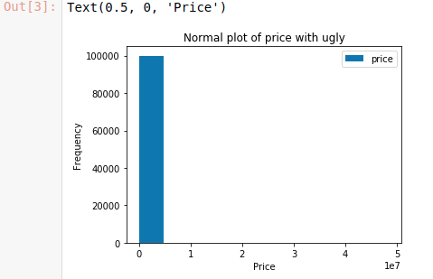

More Informative ::

    Plot with 90 percentile of price data.
    Since the price range is very high so we can not draw nice graph with entire data set.
    That is the reason its looks ugly.
    This graph I have taken the 90 percentile of price from minimum value of price.
    Which clearly shows that after some price the number of sale decreased exponetially.

    data.hist(alpha=1, bins='auto')
    plt.xlim(np.min(data['price']), np.percentile(data['price'], 90))
    plt.title('plot with 99 percentile');
    plt.xlabel('Price')
    plt.ylabel('Frequency')

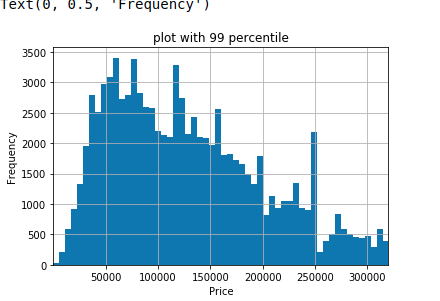

4)Is real estate more expensive in London? Plot histograms for the two subsets of properties inside and outside London, respectively.
 For practical purposes, we can define "inside London" to mean that the string in the 14th column (Python indexing column 13) includes the string LONDON.

Price Inside and Outside London::

    Histogram with Price range inside and out side london
    This price range histogram clearly shows that the housing sold out side london is always higher than in london.

    inside_london = data[data.loc[:, ('location')].str.contains("LONDON")]
    price_rang_in_london = inside_london.groupby(pd.qcut(inside_london.loc[:, ('price')], 10)).size()
    value('inside london price range', price_rang_in_london.head())
    outside_london = data[~data.loc[:, ('location')].str.contains("LONDON")]
    price_rang_out_london = outside_london.groupby(pd.qcut(outside_london.loc[:, ('price')], 10)).size()
    value('outside london price range', price_rang_out_london.head())
    plt.figure(figsize=(12, 4));
    ax1 = plt.subplot(121)
    plt.title('frequency of price range inside london');
    price_rang_in_london.plot(kind='bar', ax=ax1);
    ax2 = plt.subplot(122)
    price_rang_out_london.plot(kind='bar', ax=ax2)
    plt.title('frequency of price range out side london');
    plt.xlabel('Price')
    plt.ylabel('Frequency')

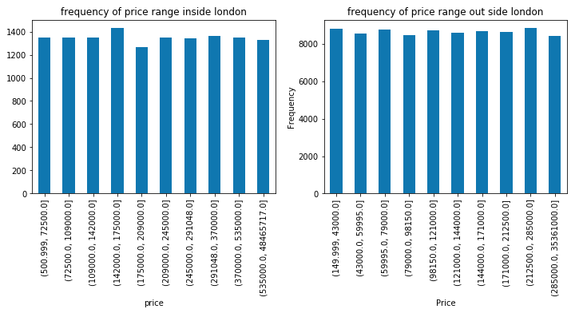

99% Data Graph::

    Histogram with 99% of price data Inside and out side london
    This Graph shows that price in london is always higher than out side london.
    The buyer in london decreases more sharply than outside london as the price increases.

    plt.figure(figsize=(12, 3));
    ax3 = plt.subplot(121)
    inside_london.hist(alpha=1, bins='auto', ax=ax3)
    plt.xlim(np.min(inside_london.loc[:, ('price')]), np.percentile(inside_london.loc[:, ('price')], 99))
    ax3.set_xticklabels(ax3.get_xticks(), rotation=45)
    plt.title('price in london with 99 percentile');
    plt.xlabel('Price')
    plt.ylabel('Frequency')
    ax4 = plt.subplot(122)
    outside_london.hist(alpha=1, bins='auto', ax=ax4)
    plt.xlim(np.min(outside_london.loc[:, ('price')]), np.percentile(outside_london.loc[:, ('price')], 99))
    plt.title('price out of london with 99 percentile');
    plt.xlabel('Price')
    plt.ylabel('Frequency')

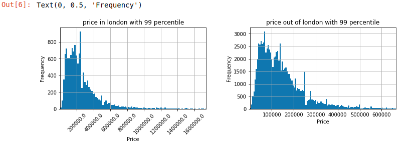

Optional task. Make a plot that shows the average price per year.

Average price::

    Average price per year in side london and out side london
    This graph shows that the price increased inside and out side london consistentely.
    But in recent year the average price decreased in london while out side london its consistentely increasing.

    inside_london.loc[:, ('date')] = pd.to_datetime(inside_london.loc[:, ('date')])
    in_london = inside_london.groupby(inside_london.loc[:, ('date')].dt.year)['price'].agg(['sum', 'mean', 'max'])
    header('Inside london price describe yearly')
    print(in_london.head())

    outside_london.loc[:, ('date')] = pd.to_datetime(outside_london.loc[:, ('date')])
    out_london = outside_london.groupby(outside_london.loc[:, ('date')].dt.year)['price'].agg(['sum', 'mean', 'max'])
    header('Inside london price describe yearly')
    print(out_london.head())
    # Matplotlib:
    plt.figure(figsize=(12, 4));
    ax1 = plt.subplot(121)

    plt.plot(in_london.index, in_london['mean']);
    plt.title('yearly average price in london');
    plt.xlabel('Year')
    plt.ylabel('Mean price')
    ax2 = plt.subplot(122)

    plt.plot(out_london.index, out_london['mean']);
    plt.title('yearly average price out london');
    plt.xlabel('Year')
    plt.ylabel('Mean price')

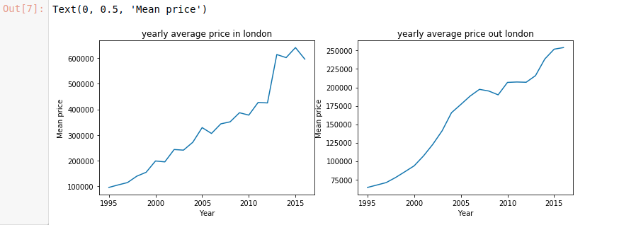

Average Price In England::

    Average price of house per year in england
    The housing price in england consistentely increased but in recent year the average housing price is decreasing.

    england = data
    england['date'] = pd.to_datetime(england.date)
    england = england.groupby(england['date'].dt.year)['price'].agg(['sum', 'mean', 'max'])
    print(england.head())
    plt.plot(england.index, england['mean']);
    plt.title('yearly average price england');
    plt.xlabel('Year')
    plt.ylabel('Mean price')

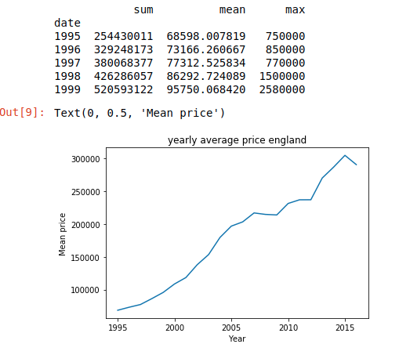

Part 2: Generating random numbers (quick detour)
Consider the random number generation functions in NumPy, documented here (Links to an external site.).
1)Generate a set of random numbers using the function rand and plot its histogram. What is the shape of this histogram and why?

Solution::

    The below histogram shows that random numbers generated by rand().
    The shape of generated random number is uniform distribution.

    number = np.random.rand(1000)
    plt.hist(number);
    plt.xlabel('Random number')
    plt.ylabel('Frequency')

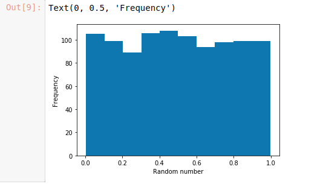

2)Investigate how the shape of the histogram is affected by the number of random numbers you have generated.
Large Number::

    Histogram for random number generation with rand fo
    As the number of randoms number get increased the uniform distribution over [0, 1) is more uniform.

    plt.style.use('seaborn-white')
    plt.figure(figsize=(12, 4));
    ax1 = plt.subplot(121)
    plt.title('Random Number with 1000')
    numbers1000 = np.random.rand(1000);
    plt.hist(numbers1000);
    plt.xlabel('Random number')
    plt.ylabel('Frequency')
    ax2 = plt.subplot(122)
    plt.title('Random number with 10000');
    numbers10000 = np.random.rand(10000)
    plt.hist(numbers10000);
    plt.xlabel('Random number')
    plt.ylabel('Frequency')

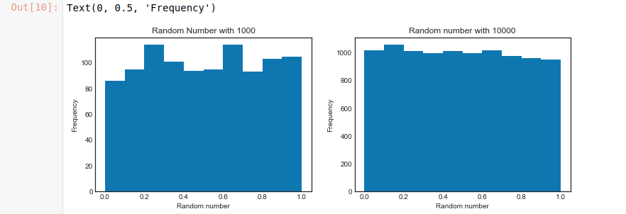

3)Instead of using rand (which corresponds to a uniform distribution), generate numbers using some other distribution and plot a histogram.

Geometric::

    geometric distribution random number.
    The number's frequency is more at lower end and less at higher end.It means the probability op geting random number is more on initial point compare to the end point.

    geo_number=np.random.geometric(p=0.3, size=10000)
    sns.distplot(geo_number, bins=50, kde=False);

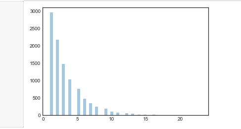

4)What is the shape now? For instance, with normal, the normal (or Gaussian) distribution, you should get the familiar bell shape,

Solution::

    Histogram for gauss random number which is bell type.
    The gauss random number is even distribution of max frexuency therefore graph is of bell shape.

    gauss_numbers = np.random.normal(loc=20, scale=10, size=10000);
    plt.figure(figsize=(9, 5))
    sns.distplot(gauss_numbers, bins=50, kde=False);
    plt.xlabel('Random number')
    plt.ylabel('Frequency')

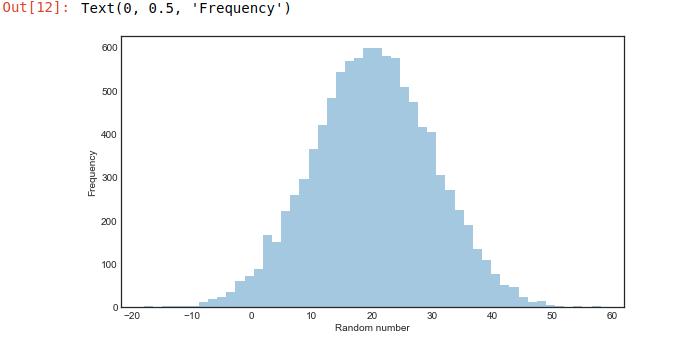

Part 3: Simulating probabilistic models

Here we simulate a few probabilistic models to investigate certain situations and the corresponding random variable distributions.
When you are done feel free to change the various parameters to see how they affect the results.

Please note.
When you have implemented the code for these three scenarios, please reflect about how well you think the models correspond to the real world.
What are the simplifying assumptions? Please discuss in your report.

Question A::

    (a) Modeling a student at an exam
    Let's make a model of a student that answers questions in an exam. The exam consists of a fixed set of questions, and a student answers
    each question correctly or incorrectly with some fixed probability. We will now implement this model in a step-by-step fashion.

    Answering a single question

    Write a Python function that simulates that the student answers a single question either correctly or incorrectly.
    The function should return a Boolean value (that is, True or False) that says whether the question was answered correctly.
    You can assume that the probability of a correct answer is a given parameter p_success.

    def success(p_success):
    ... YOUR CODE HERE ...

    Run this function a few times and check that it seems to work correctly.
    Note: Formally, we say that this function simulates a random variable with a Bernoulli distribution.
    The metaphor typically used is that of a coin toss with an unfair coin.

    Again, run the function a few times and check that it seems to work as it should.

    Investigating the distribution

    Write some code to call exam_score several times, and collect the result of all the calls in a simple Python list, NumPy array, or Pandas Series.

    Let the value of p_correct be 0.8 and n_instances be 20. Run exam_score 10,000 times and collect the results. Then plot a histogram of the results.

    Note: This type of scenario corresponds to the binomial distribution which we will discuss formally in the next lecture.
    The typical explanation is that we toss an unfair coin a given number times and count the number of times the heads side came up.

Solution::

    The Bernoulli distribution is the discrete probability distribution of a random variable
    which takes a binary, boolean output: 1 with probability p, and 0 with probability (1-p).
    Here similarly the boolean outcome of question correct probality is 0.8 and incorrect probabilty is 0.2.

    def success(p_success):
        issuccess = np.random.random() < p_success
        return issuccess

    Binomial distribution describes the number of successes k achieved in n trials, where probability of success is p
    Similarly here the number of correct answer achived in 20 trials with probability 0.8

    def exam_score(p_correct, n_instances):
        score = 0
        for i in range(n_instances):
            if (success(p_correct)):
                score = score + 1
        return score

    def data_set():
        dataset = []
        for i in range(10000):
            dataset.append(exam_score(0.8, 20))
        return dataset

    data = data_set()
    print(data[:10])
    plt.figure(figsize=(12, 4));

    sns.distplot(data, bins=100, kde=False);

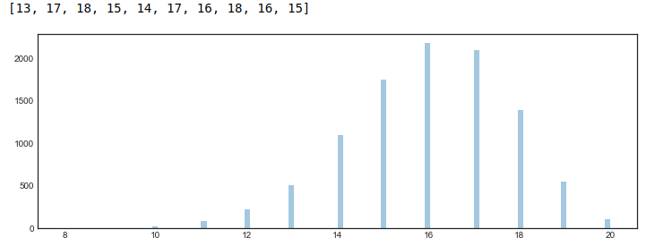

Solution2::

    Second method to solve this problem with choice.The result will be same.

    def exam_score():
    options = [1, 0]
    options_probs = [0.8, 0.2]
    total_score = sum(np.random.choice(options, size=20, p=options_probs))
    return total_score

    plt.figure(figsize=(12, 4));
    samples = [exam_score() for _ in range(10000)]
    print(samples[:10])
    sns.distplot(samples, bins=100, kde=False);

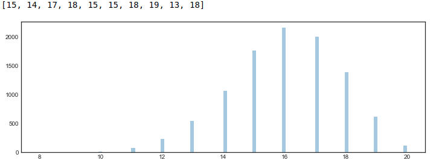

Question B::

    (b) The persistent student
    We will now simulate a scenario where a student takes an exam repeatedly, until passing.

    If a student does not pass an exam, the University of Gothenburg allows the student to go to an unlimited number of re-sit exams.
    Let's assume that students never give up, so that they will go to the exam again and again until they finally pass. Write a function that simulates a student going to exams until passing, and returns the number of attempts the student needed before passing. You can assume that the probability of passing a single exam is a constant p_pass. If you want, you can reuse your function success from the previous task: in this case, this would mean a passed exam, not just a correctly answered question.

    def number_of_attempts(p_pass):
         ... YOUR CODE HERE ...

    Investigating the distribution

    Simulate this model multiple times, as in (a). For instance, let p_pass be 0.4. Plot the result using a histogram.

    Note: This type of scenario corresponds to the geometric distribution.

Solution::

    The Bernoulli distribution is the discrete probability distribution of a random variable
    which takes a binary, boolean output: 1 with probability p, and 0 with probability (1-p).
    Here the below solution is mixture of binomial distribution and geometrical distribution.
    Geometric distribution is a special case of negative binomial distribution,
    where the experiment is stopped at first failure.
    So while it is not exactly related to binomial distribution, it is related to negative binomial distribution.

    def isfailed(p_pass):
        failed = np.random.random() < p_pass
        return failed

    def number_of_attempts(p_pass):
        attempt = 1;
        fail = isfailed(p_pass)
        while fail:
            attempt = attempt + 1
            fail = isfailed(p_pass)
        return attempt

    def data_set():
        attemptset = []
        for i in range(10000):
            attemptset.append(number_of_attempts(0.4))
        return attemptset

    The number of student pass hiher at 1st attempt compare to the next attempt.It is geometrical distribution.
    Student will attempt untill passed based on probability 0.4.

    data = pd.DataFrame(data_set())

    data.hist()

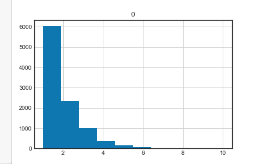

Question C::

    (c) An unusual village The inhabitants of Normlösa, a small village in the fertile plains of eastern Sweden,
    are infamous not only for their unscrupulous behavior but also because the males in the village are exceptionally short and stocky,
    while the female villagers tend to be tall and lean. Geneticists from nearby Linköping University have so far failed to come up
    with a credible explanation of this remarkable tendency.

    Write a Python function to generate the height and weight of a random inhabitant of Normlösa. Use the following process:

        first, randomly select the gender of the villager; the proportion of males in this village is about 40%.
        then draw random numbers from a Gaussian distribution (normal distribution) for the height and weight of the person;
        for this, you might use the NumPy function np.random.normal(loc, scale), where loc is the mean and scale the standard deviation.

            for males, the mean height is 140 and the height standard deviation is 15; the mean weight is 90 and the weight standard deviation is 10;
            for females, the mean height is 195 and the height standard deviation is 10; the mean weight is 60 and the weight standard deviation is 5.

        Generate a dataset consisting of height–weight pairs for 50 Normlösa inhabitants. Make a scatterplot of the height–weight data.

Solution::

    Here in every trial or iteration is a discrete probability distribution of a random variable
    which is a Bernoulli distribution but every boolean we are generation normal random number based on
    height and weight ,which is a gauss random number (even distribution of mean of height and weight) .

    def generateVillageData(p_male):
        data = []
        for i in range(50):
            if (np.random.random() < p_male):
                hight_male = np.random.normal(loc=140, scale=15, size=1);
                weight_male = np.random.normal(loc=90, scale=10, size=1);
                data.append({'height': hight_male, 'weight': weight_male, 'gender': 'M'})
            else:
                hight_female = np.random.normal(loc=195, scale=10, size=1);
                weight_female = np.random.normal(loc=60, scale=5, size=1);
                data.append({'height': hight_female, 'weight': weight_female, 'gender': 'F'})
        return data

    village_data = generateVillageData(0.4)
    df = pd.DataFrame(village_data)
    print(df.head())

    OUT::
            height                   weight            gender
    0  [184.31336247098463]   [54.12868265768663]      F
    1  [187.82664498507756]   [58.69034250779687]      F
    2  [152.68466920308612]  [116.99248523375181]      M
    3  [188.60258609659274]  [49.610587765681764]      F
    4  [198.56752777140474]    [59.5755305200402]      F

    Here in the graph it shows that gender distribution based on height and weight ratio.
    The left-upper dots are male distribution (short and stocky) and right lower one female distribution (tall and lean).

    colors = (0, 0, 0)
    area = np.pi * 3
    plt.scatter(df['height'], df['weight'], s=area, color=['blue'], alpha=0.5)
    plt.title('Height and weight graph');
    plt.xlabel("Height")
    plt.ylabel("Weight")

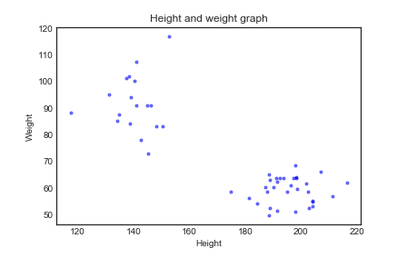

KDE Plot::

    #The KDE plot with  female and male density.
    plt.figure(figsize=(12, 4));
    ax1 = plt.subplot(121, sharey=ax1);
    plt.title('Height and weight graph with kde');
    sns.kdeplot(df['height'], df['weight'], shade=True);

    #The KDE plot with green colour female and red is male.

    ax2 = plt.subplot(122, sharey=ax1);
    men = df[df['gender'] == 'M'];
    women = df[df['gender'] == 'F']
    sns.kdeplot(men['height'], men['weight'], cmap='Reds')
    sns.kdeplot(women['height'], women['weight'], cmap='Greens');
    plt.title('Height and weight graph with spiral colour');

    #The correlation coeeficient for the data with height is negative
    print('data correlation for height and weight',stats.pearsonr(df['height'], df['weight']))

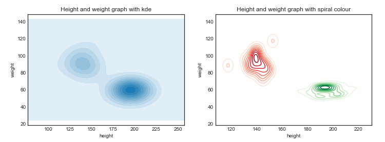

Solution2::

    #2nd approad with choice

    gender_category = ['M', 'F']
    gender_probs = [0.4, 0.6]
    def generate_dataset():
        gender = np.random.choice(gender_category, p=gender_probs)
       if gender == 'M':
            height= np.random.normal(loc=140, scale=15, size=1);
            weight = np.random.normal(loc=90, scale=10, size=1);
           gender = 'M'
      else:
            height = np.random.normal(loc=195, scale=10, size=1);
            weight = np.random.normal(loc=60, scale=5, size=1);
          gender = 'F'
        return [height,weight,gender]

    samples = pd.DataFrame([generate_dataset() for _ in range(50)],
                    columns=['height','weight','gender']).rename_axis('id', axis=0)

    plt.figure(figsize=(15, 4));
    ax1 = plt.subplot(121);
    #The KDE plot with  female and male density.
    plt.title('Height and weight graph with kde');
    sns.kdeplot(samples['height'], samples['weight'], shade=True);

    #The KDE plot with green colour female and red is male.

    ax2 = plt.subplot(122, sharey=ax1);
    men = samples[samples['gender'] == 'M'];
    women = samples[samples['gender'] == 'F']
    sns.kdeplot(men['height'], men['weight'], cmap='Reds')
    sns.kdeplot(women['height'], women['weight'], cmap='Greens');
    plt.title('Height and weight graph with spiral colour');

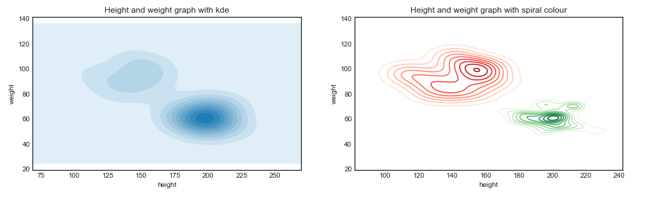

Let's pretend for a moment that you have been given the datapoints (the list of height–weight pairs) but you have no information about how they were generated.
Could you think of a way to reconstruct the parameters you used in the code previously? For example,
that the proportion of males is 40%, that the mean weight of a female is 60 kilograms, etc. (NB: this question should be easy if
you have taken the course Introduction to data science. As an optional task, you may write code to reconstruct these parameters using the methods presented there.
If you haven't taken that course, and have no idea how to answer the question, please discuss with the lab instructor.)
Note: Formally, these data points are generated using a Gaussian mixture model. We will come back to this model and study it more extensively in later lectures.

Solution::

    Here i have generated the data set with given mean (height and weight) without giving the category of female and male.

    from scipy.cluster.hierarchy import dendrogram, linkage
    from scipy.cluster.hierarchy import cophenet
    from scipy.spatial.distance import pdist

    def generateData(p_male):
        data = []
        for i in range(50):
            if (np.random.random() < p_male):
                hight= np.random.normal(loc=140, scale=15, size=1);
                weight = np.random.normal(loc=90, scale=10, size=1);
                data.append({'height': hight, 'weight': weight})
            else:
                hight = np.random.normal(loc=195, scale=10, size=1);
                weight = np.random.normal(loc=60, scale=5, size=1);
                data.append({'height': hight, 'weight': weight})
        return data

    village_data = generateData(0.4)

    Plotting the scatter graph with generated data set

    dataframe = pd.DataFrame(village_data)

    plt.scatter(dataframe['height'], dataframe['weight'])
    plt.title('Height and weight graph without custer');
    plt.xlabel("Height")
    plt.ylabel("Weight")

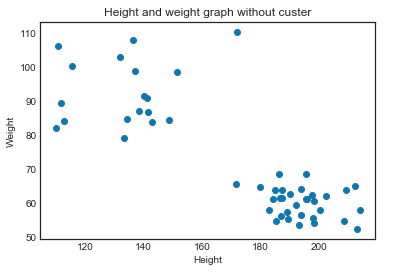

Find Cluster::

    First i need to find the number of cluster possible in given data set.With visual alson we can see that there is two clear cluster possible in the given graph.

    Similarly i am verifying this using kmean algorithm.
    Determine the number of cluster possible in given data set using elbow method which provide

    wcss = []
    for i in range(1, 11):
        kmeans = KMeans(n_clusters=i, init='k-means++', max_iter=50, n_init=10, random_state=0).fit(dataframe)
        wcss.append(kmeans.inertia_)

    plt.plot(range(1, 11), wcss)
    plt.title('Elbow Method')
    plt.xlabel('Number of clusters')
    plt.ylabel('WCSS')

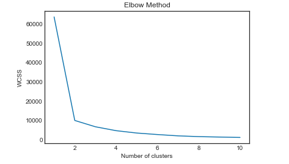

Plotting Centroid::

    Plotting cluster center point with red colour in the center using kmean algorithm.
    Where center axis pont calculated based on optimal distance from each point of the cluster.

    kmeans = KMeans(n_clusters=2, random_state=0)
    pred_y = kmeans.fit_predict(dataframe)
    print(kmeans.cluster_centers_[:, 0])
    print(kmeans.cluster_centers_[:, 1])
    plt.scatter(dataframe['height'], dataframe['weight'])
    plt.scatter(kmeans.cluster_centers_[:, 0], kmeans.cluster_centers_[:, 1], s=50, c='red')

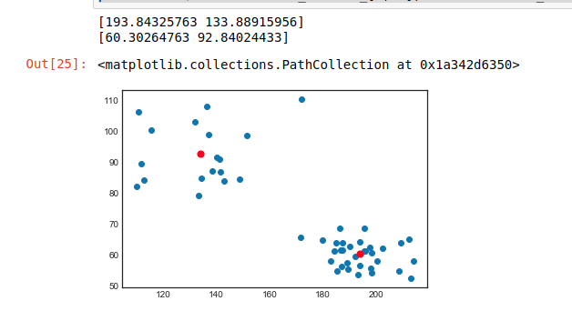

Plotting Centroid using height and weight::

    The center point of cluster is given as mean [height  weight] of male and feamle.Which is aproximately same to the above cetroid of the cluster.

    kmeans = KMeans(n_clusters=2, random_state=0)
    pred_y = kmeans.fit_predict(dataframe)
    female_male_mean_height=[195,140]
    female_male_mean_weight=[60,90]
    plt.scatter(dataframe['height'], dataframe['weight'])
    plt.scatter(female_male_mean_height, female_male_mean_weight, s=50, c='red')

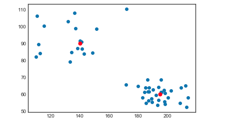