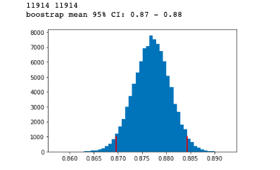
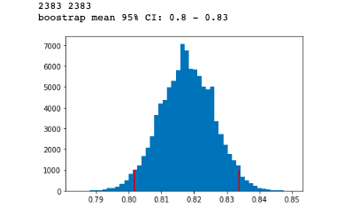
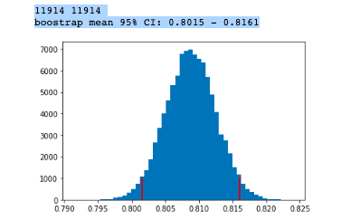
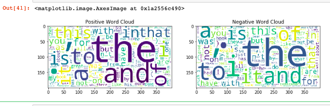

==================
Assignment2
==================
Assignment 2::

    Text Classification with Naive Bayes
    In this assignment, you will implement the Naive Bayes classification method and use it for sentiment
    classification of customer reviews.

    Work in groups of two or three and solve the tasks described below. Write a short report containing your answers,
    including the plots and create a zip file containing the report and your Python code.

    Alternatively, write a Jupyter notebook including your code, plots, and comments.
    In this case, when you are finished editing, re-run all the cells to make sure they work and then convert
    your notebook into a pdf (using the print function). Submit both the .ipynb file and the .pdf file.

    Submit your solution through the Canvas website.

    In this assignment, the Naive Bayes code must be your own. You are not allowed to use machine learning
    toolkits such as scikit-learn for the Naive Bayes part, except in one of the optional tasks.

    understand Naive Bayes, one of the simplest probabilistic classification techniques;
    see how a non-trivial statistical model is implemented in practice;
    practice your Python coding skills for common tasks such as computing frequencies;
    practice common statistical experimental techniques such as the calculation
    of interval estimates and p-values for comparisons.

    Preliminaries
    Read up the Naive Bayes classifier: how to compute apply the Naive Bayes formula,
    and how to estimate the probabilities you need. For instance,
    repeat the slides from the lecture about estimation and Naive Bayes.
    In particular the slides which describe the Naive Bayes formula,
    and the ones on how to estimate the required probabilities.

    For the second part, you can also repeat the material related to interval estimates and comparison
    (part of Lecture 5, posted a day before the lecture).

    If you wish, you may also have a look at the following classic paper:

    Bo Pang, Lillian Lee, and Shivakumar Vaithyanathan: Thumbs up?
    Sentiment Classification using Machine Learning Techniques (Links to an external site.).
    In Proceedings of the 2002 Conference on Empirical Methods in Natural Language Processing (EMNLP 2002).
    The dataset we are using was originally created for the experiments described in the following paper.
    The research described here addresses the problem of domain adaptation,
    such as adapting a classifier of book reviews to work with camera reviews.

    John Blitzer, Mark Dredze, and Fernando Pereira: Biographies, Bollywood, Boom-boxes and Blenders:
    Domain Adaptation for Sentiment Classification. (Links to an external site.)
    In Proceedings of the 45th Annual Meeting of the Association of Computational Linguistics (ACL 2007).

    Assignment hints:
    You can find some useful hints to get you started. Some overlap a bit with the preparatory remarks.
    You can find the hints here dit862_assignment_2_hints.pdfPreview the document.

    Preparatory remarks
    Frequency-counting in Python. The built-in data structure called Counter is a special type of
    Python dictionary that is adapted for computing frequencies. In the following example,
    we compute the frequencies of words in a collection of two short documents.
    We use Counter in three different ways, but the end results are the same
    (freqs1, freqs2, and freqs3 are identical at the end). The Counter will not give a KeyError
    if you look for a word that you didn't see before.

Solution::

    from collections import Counter

    example_documents = ['the first document'.split(), 'the second document'.split()]

    print(example_documents)

    freqs1 = Counter()
    for doc in example_documents:
        for w in doc:
            freqs1[w] += 1

    freqs2 = Counter()
    for doc in example_documents:
        freqs2.update(doc)

    freqs3 = Counter(w for doc in example_documents for w in doc)

    total=sum(iter(freqs3.values()))
    print(total)
    print(freqs2)
    print(freqs2.most_common(2))
    print(freqs3)
    print(freqs3['top'])

    OUT:

    [['the', 'first', 'document'], ['the', 'second', 'document']]
    6
    Counter({'the': 2, 'document': 2, 'first': 1, 'second': 1})
    [('the', 2), ('document', 2)]
    Counter({'the': 2, 'document': 2, 'first': 1, 'second': 1})
    0

    Logarithmic probabilities. If you multiply many small probabilities you may run into problems with
    numeric precision: the probability becomes zero. To handle this problem, I recommend that you compute
    the logarithms of the probabilities instead of the probabilities. To compute the logarithm in Python,
    use the function log in the numpy library.

    import numpy as np
    P1=8
    P2=8
    logp=np.log(P1 * P2)
    print(logp)
    print(np.log(P1) + np.log(P2))
    exp=np.exp(logp)
    print(exp)
    print(np.log(0.00030795010653409093))

    OUT:
    4.1588830833596715
    4.1588830833596715
    63.99999999999998
    -8.085572779885217

    The logarithms have the mathematical property that np.log(P1 * P2) = np.log(P1) + np.log(P2).
    So if you use log probabilities, all multiplications (for instance, in the Naive Bayes probability formula)
    will be replaced by sums.

    If you'd like to come back from log probabilities to normal probabilities, you can apply the exponential function,
    which is the inverse of the logarithm: prob = np.exp(logprob). (However, if the log probability is too small,
    exp will just return zero.)

    Reading the review data
    Download this file. This is a collection of customer reviews from six of the review topics used in the
    paper by Blitzer et al., (2007) mentioned above. The data has been formatted so that there is one review per line,
    and the texts have been split into separate words ("tokens") and lowercased. Here is an example of a line.

    music neg 544.txt i was misled and thought i was buying the entire cd and it contains one song
    A line in the file is organized in columns:

    0: topic category label (books, camera, dvd, health, music, or software)
    1: sentiment polarity label (pos or neg)
    2: document identifier
    3 and on: the words in the document
    Here is some Python code to read the entire collection[1].

    from codecs import open
    #from __future__ import division

    def read_documents(doc_file):
        docs = []
        labels = []
        with open(doc_file, encoding='utf-8') as f:
            for line in f:
                words = line.strip().split()

                #every line reading from 3 worlds
                docs.append(words[3:])

                #every line word index 1 is the label(neg or pos)
                labels.append(words[1])
        return docs, labels

    all_docs, all_labels = read_documents('all_sentiment_shuffled.txt')

    print(all_docs[:2])
    print(all_labels[:10])
    print(len(all_docs))
    print(len(all_labels))

    [['i', 'bought', 'this', 'album', 'because', 'i', 'loved', 'the', 'title', 'song', '.', 'it', "'s", 'such',
    'a', 'great', 'song', ',', 'how', 'bad', 'can', 'the', 'rest', 'of', 'the', 'album', 'be', ',', 'right', '?',
    'well', ',', 'the', 'rest', 'of', 'the', 'songs', 'are', 'just', 'filler', 'and', 'are', "n't", 'worth', 'the',
     'money', 'i', 'paid', 'for', 'this', '.', 'it', "'s", 'either', 'shameless', 'bubblegum', 'or',
     'oversentimentalized', 'depressing', 'tripe', '.', 'kenny', 'chesney', 'is', 'a', 'popular', 'artist', 'and',
     'as', 'a', 'result', 'he', 'is', 'in', 'the', 'cookie', 'cutter', 'category', 'of', 'the', 'nashville',
     'music', 'scene', '.', 'he', "'s", 'gotta', 'pump', 'out', 'the', 'albums', 'so', 'the', 'record', 'company',
     'can', 'keep', 'lining', 'their', 'pockets', 'while', 'the', 'suckers', 'out', 'there', 'keep', 'buying',
     'this', 'garbage', 'to', 'perpetuate', 'more', 'garbage', 'coming', 'out', 'of', 'that', 'town', '.', 'i',
     "'ll", 'get', 'down', 'off', 'my', 'soapbox', 'now', '.', 'but', 'country', 'music', 'really', 'needs', 'to',
     'get', 'back', 'to', 'it', "'s", 'roots', 'and', 'stop', 'this', 'pop', 'nonsense', '.', 'what', 'country',
     'music', 'really', 'is', 'and', 'what', 'it', 'is', 'considered', 'to', 'be', 'by', 'mainstream', 'are', 'two',
     'different', 'things', '.'],
     ['i', 'was', 'misled', 'and', 'thought', 'i', 'was', 'buying', 'the', 'entire','cd', 'and', 'it', 'contains',
     'one', 'song']]
    ['neg', 'neg', 'neg', 'pos', 'pos', 'neg', 'neg', 'pos', 'neg', 'pos']
    11914
    11914

    We first remove the document identifier, and also the topic label,
    which you don't need unless you solve the first optional task. Then,
    we split the data into a training and an evaluation part. For instance,
    we may use 80% for training and the remainder for evaluation.

    #spliting the document in 80% and 20%

    split_point = int(0.80*len(all_docs))
    print(split_point)
    #before 80% data
    train_docs = all_docs[:split_point]
    print(len(train_docs))
    train_labels = all_labels[:split_point]

    # eval data set 20 % data
    eval_docs = all_docs[split_point:]
    print(len(eval_docs))
    eval_labels = all_labels[split_point:]

    OUT:
        9531
        9531
        2383

    Class probability(positive and negative class probability)

    Estimating parameters for the Naive Bayes classifier
    Write a Python function that uses training set of documents to estimate the probabilities in the Naive Bayes model.
    Return some data structure containing the probabilities or log probabilities.
    The input parameter of this function should be a list of documents and another
    list with the corresponding polarity labels. It could look something like this:

    def train_nb(documents, labels):
        ...
        (return the data you need to classify new instances)

    Hint 1. In this assignment, it is acceptable if you assume that we will always use the pos and neg categories.
    However, it is of course nicer if the possible categories are not hard-coded, especially
    if you solve the last optional task.

    Hint 2. Some sort of smoothing will probably improve your results.
    You can implement the smoothing either in train_nb or in score_doc_label that we discuss below.

    I am creating the dictionary as {word:probability} using naive byase naive bayes classifier.
    Where the smoothning factor consider as 1(additive smoothing alpha=1).
    I have added the one extra word in dictionary as unknown(i.e for thos words which not considered in dictionanry)

Solution::

    # feature probability ex: 𝑃(′nice′|positive)
    def train_nb(documents, labels, smoothning_factor):

        freqs = Counter(w for w in labels)
        p_pos=freqs['pos']/len(labels)
        p_neg=freqs['neg']/len(labels)

        pos_dict= Counter()
        neg_dict= Counter()

        #making dictionary for pos and neg with word and count
        for label, document in zip(labels,documents):
            if (label == 'pos'):
                #adding the counter of words in positive category
                freqs_pos = Counter(w for w in document)
                pos_dict = pos_dict+freqs_pos;
            else:
                #adding the counter of words in negative category
                freqs_neg = Counter(w for w in document)
                neg_dict = neg_dict+freqs_neg;

        pos_words_count=len(pos_dict.keys())

        neg_words_count=len(neg_dict.keys())

        #total words count sum in each class pos and neg
        total_pos_words=sum(iter(pos_dict.values()))
        total_neg_words=sum(iter(neg_dict.values()))

        #converting value of words from count to probability basesd of naive bayes classifier.
        #With additive smoothing where alpha=1
        # 𝑃(‘word‘| class) = (v+1)/(total_words+(1*len(pos_dict.keys()))

        pos_dict={k: (v+smoothning_factor) / (total_pos_words+smoothning_factor*pos_words_count) for k, v in pos_dict.items()}
        neg_dict={k: (v+smoothning_factor) / (total_neg_words+smoothning_factor*neg_words_count) for k, v in neg_dict.items()}

        #Add unknown words in the dictionary
        pos_prob_unknown=(1+smoothning_factor)/(total_pos_words+smoothning_factor*pos_words_count)
        neg_prob_unknown=(1+smoothning_factor)/(total_neg_words+smoothning_factor*neg_words_count)
        pos_dict.update({'unknown': pos_prob_unknown})
        neg_dict.update({'unknown': neg_prob_unknown})
        return pos_dict, neg_dict, p_pos, p_neg

    pos_prob_dict, neg_prob_dict, p_pos, p_neg=train_nb(train_docs,train_labels,1)
    print("####################positive######################")
    print(len(pos_prob_dict.keys()))
    print("####################negative######################")
    print(len(neg_prob_dict.keys()))

    OUT:
    ####################positive######################
    35688
    ####################negative######################
    33990

    Classifying new documents
    Write a function that applies the Naive Bayes formula to compute the logarithm of the probability of
    observing the words in a document and a sentiment polarity label.
    <SOMETHING> refers to what you returned in train_nb.

    def score_doc_label(document, label, <SOMETHING>):
        ...
        (return the log probability)

    The function for  logrithmic probability for the given document.

 Solution::

    #Naive Bayes:
    #𝑃(𝑤1, . . . ,𝑤𝑛, 𝑦) = 𝑃(𝑦) ⋅ 𝑃(𝑤1|𝑦) ⋅ . . . ⋅ 𝑃(𝑤𝑛|𝑦)
    #log(𝑃(𝑤1, . . . ,𝑤𝑛, 𝑦))=log(𝑃(𝑦))+log(𝑃(𝑤1|𝑦))+........log(𝑃(𝑤𝑛|𝑦)

    def score_doc_label(document, label, classdict, p_pos, p_neg):
        doc_array=[]
        if(isinstance(document,list)):
            doc_array=document
        else:
            doc_array=document.split()
        doc_log_prob=0;

        if(label=='pos'):
            doc_log_prob=np.log(p_pos)
        else:
            doc_log_prob=np.log(p_neg)

        for w in doc_array:
            #if dictionay does not contain the word it will return unknown
            w_prob=classdict.get(w,'unknown')
            if(w_prob =='unknown'):
                w_prob = classdict.get('unknown')
            doc_log_prob=doc_log_prob+np.log(w_prob)

        return doc_log_prob

    Sanity check 1. Try to apply score_doc_label to a few very short documents;
    to convert the log probability back into a probability, apply np.exp or math.exp.
    For instance, let's consider small documents of length 1.

    The probability of a positive document containing just the word "great" should be a small number,
    depending on your choice of smoothing parameter, it will probably be around 0.001–0.002. In any case,
    it should be higher than the probability of a negative document with the same word. Conversely,
    if you try the word "bad" instead, the negative score should be higher than the positive.

    print('great word probability in both dictionary')
    great_prob_pos=score_doc_label('great','pos',pos_prob_dict, p_pos, p_neg)
    great_prob_neg=score_doc_label('great','neg',neg_prob_dict, p_pos, p_neg)
    print('pos log prob:',great_prob_pos,'pos exp prob',np.exp(great_prob_pos))
    print('neg log prob:',great_prob_pos,'neg exp prob',np.exp(great_prob_pos))

    print('bad word probability in both dictionary')
    bad_prob_pos=score_doc_label('bad','pos',pos_prob_dict, p_pos, p_neg)
    bad_prob_neg=score_doc_label('bad','neg',neg_prob_dict, p_pos, p_neg)
    print('pos log prob:',bad_prob_pos,'pos exp prob',np.exp(bad_prob_pos))
    print('neg log prob:',bad_prob_neg,'neg exp prob',np.exp(bad_prob_neg))

    OUT:

    great word probability in both dictionary
    pos log prob: -6.607366165997133 pos exp prob 0.0013503841573695374
    neg log prob: -6.607366165997133 neg exp prob 0.0013503841573695374
    bad word probability in both dictionary
    pos log prob: -8.64441402705097 pos exp prob 0.0001761078393383867
    neg log prob: -7.671500982140588 neg exp prob 0.0004659179640530532

    Sanity check 2. Your function score_doc_label should not crash for the document ['a', 'top-quality', 'performance'].

    print('a', 'top-quality', 'performance')
    doc=['a', 'top-quality', 'performance']
    print(doc,' prob in pos:',score_doc_label(doc,'pos',pos_prob_dict, p_pos, p_neg))
    print(doc,' prob in neg:',score_doc_label(doc,'neg',neg_prob_dict, p_pos, p_neg))

    a top-quality performance
    ['a', 'top-quality', 'performance']  prob in pos: -25.607604046606923
    ['a', 'top-quality', 'performance']  prob in neg: -26.27156368852102

    Next, based on the function you just wrote, write another function that classifies a new document.

    def classify_nb(document, <SOMETHING>):
     ...
        (return the guess of the classifier)

    Again, apply this function to a few very small documents and make sure that you get the output you'd expect.

Solution::

    #The below method classify the document based on above model.(document could be either pos or neg)

    # guess class based on :guess = argmax𝑦 (𝑃(𝑤1, . . . ,𝑤𝑛, 𝑦))
    # Since here we have only two class there for we can just compare in if condition and decide the class
    # Othewise we can use the library np.argmax(list_prob_class)
    def classify_nb(document, pos_class_dict, neg_class_dict, p_pos, p_neg):
        prob_pos_class=score_doc_label(document,'pos',pos_class_dict, p_pos, p_neg)
        prob_neg_class=score_doc_label(document,'neg',neg_class_dict, p_pos, p_neg)
        if(prob_pos_class>prob_neg_class):
            return 'pos'
        else:
            return 'neg'

    print(classify_nb('This is a great product',pos_prob_dict,neg_prob_dict,p_pos, p_neg))
    print(classify_nb('this is a bad product',pos_prob_dict,neg_prob_dict,p_pos, p_neg))

    OUT:

    pos
    neg

    Evaluating the classifier
    Write a function that classifies each document in the test set and returns the list of predicted sentiment labels.

    def classify_documents(docs, <SOMETHING>):
        ...
        (return the classifier's predictions for all documents in the collection)

Solution::

    The below method return the classification list for the documents.
    The output will be the list of guess class where the document belongs to

    def classify_documents(docs, pos_class_dict, neg_class_dict, p_pos, p_neg):
    doc_lebels=[]
    for doc in docs:
            class_level=classify_nb(doc, pos_class_dict, neg_class_dict, p_pos, p_neg)
            doc_lebels.append(class_level)
    return doc_lebels

    Next, we compute the accuracy, i.e. the number of correctly classified documents divided by the total
    number of documents.

    def accuracy(true_labels, guessed_labels):
        ...
        (return the accuracy)
    What accuracy do you get when evaluating the classifier on the test set?

Solution::

    Evaluate the accuacy of the model against the all documnet,train document,and eval document.
    The acuracy percentage is above 80%.

    def accuracy(true_labels, guessed_labels):
    accuracy_count=0
    for true_label,guess_label in zip(true_labels,guessed_labels):
        if(true_label==guess_label):
            accuracy_count=accuracy_count+1
    accuracy=accuracy_count/len(guessed_labels)
    return accuracy

    #testing with all dataset
    all_gussed_labels=classify_documents(all_docs,pos_prob_dict,neg_prob_dict,p_pos, p_neg)
    accuracy_prob=accuracy(all_labels,all_gussed_labels)
    print('all data set acuracy:',accuracy_prob)

    #testing with training dataset
    train_gussed_labels=classify_documents(train_docs,pos_prob_dict,neg_prob_dict,p_pos, p_neg)
    accuracy_prob=accuracy(train_labels,train_gussed_labels)
    print('train data set acuracy:',accuracy_prob)

    #testing with eval data set
    eval_gussed_labels=classify_documents(eval_docs,pos_prob_dict,neg_prob_dict,p_pos, p_neg)
    accuracy_prob=accuracy(eval_labels,eval_gussed_labels)
    print('eval data set acuracy:',accuracy_prob)

    OUT:

    all data set acuracy: 0.8777068994460299
    train data set acuracy: 0.8926660371419578
    eval data set acuracy: 0.8178766261015527

    Error analysis
    Find a few mis-classified documents and comment on why you think they were hard to classify.For instance, you
    may select a few short documents where the probabilities were particularly high in the wrong direction.

    Error analysis: get the all document which has the wrong prediction of class.
    Which means actual labels and guess label(class) are not same.

    #used for join the all word splitted document as a sentence which look preety and easy to identify the lines.
    def join_word(docs):
        join_doc = []
        for doc in docs:
            words = " ".join(doc)
            join_doc.append(words)
        return join_doc

    #filter out the document which has actual class and guess class are different
    def non_accuracy(docs,true_labels,guessed_labels):
        wrong_classify_docs=[]
        guess_filter=[]
        actual_filter=[]
        for true_label,guess_label,doc in zip(true_labels,guessed_labels,docs):
            if(true_label!=guess_label):
                wrong_classify_docs.append(doc)
                guess_filter.append(guess_label)
                actual_filter.append(true_label)
        return wrong_classify_docs, actual_filter, guess_filter

    #finding in eval document which has wrong guess for the class
    gussed_labels=classify_documents(eval_docs,pos_prob_dict,neg_prob_dict, p_pos, p_neg)
    doc_wrong_class, actual_class, guess_class=non_accuracy(eval_docs,eval_labels,gussed_labels)
    doc_wrong_class=join_word(doc_wrong_class)
    print('wrong guess document',doc_wrong_class[:5])
    print('actual class',actual_class[:5])
    print('guess class',guess_class[:5])

    OUT:
    actual class ['neg', 'neg', 'neg', 'pos', 'pos']
    guess class ['pos', 'pos', 'pos', 'neg', 'neg']

    Choose set of 5 document from above result and find out the class which has the wrong guess.

    actual_labels=['neg', 'neg', 'neg', 'pos', 'pos']
    doc_test_set =  ["i agree with other reviewers that it feels good and does n't smell too much , however ,
                    i 've experimented with it several times to confirm my findings , and it turns out to give me
                    really bad blackheads . i 'm 25 with an oily t-zone and very dry facial skin . on mornings after
                    using this cream , i have nasty blackheads on my forehead and chin .
                    there are better products out there",
                    'this camera has a very poor lens . at 1x zoom , the barrel / spherical distortion is enormous ;
                    try taking a picture of a tiled wall . image quality is also so-so when a picture is viewed
                    at 100% ; scaled down on a computer monitor , the quality is ok . color fidelity is next to
                    nothing when using flash and auto white balance . [...]',
                    'this book offers more information about santa claus than it does the gods / godesses associated
                    with the winter soltice . the craft projects are cheesey and the recipes terrible . save your
                    money and do a little research yourself and if you want recipes or craft projects pick up one of
                    those special christmas magazines for ideas you can adapt for a pagan holiday theme .',
                    'i was able to scout out the different case options for my sony dsc-n1. after much review ,
                    i asked my wife for her opinion and she picked the lcs-nb . it holds the camera nice and snug
                    but you could work in a memory stick or battery . so far , so good',
                    'i have been a fan since valotte . and i like the other reviewers here , ca n\'t believe why this
                    cd did n\'t receive the airplay it deserves ! there must have been some politics in there ,
                    with sean \'s cd coming out on the same day ( yoko ? ) it is one of those cds that you just leave
                    on and you do n\'t feel like you have to go and skip over songs that you do n\'t like ! i love
                    every song ! ! especially " day after day " , " i should have known " , " i do n\'t want to know "
                    and my fav right now " cold " .. i hope that what i have heard is true that he is working on his
                    latest now . ca n\'t wait ! buy this cd. . you wo n\'t regret it']
    print(classify_documents(doc_test_set,pos_prob_dict,neg_prob_dict, p_pos, p_neg))

    OUT:
    ['pos', 'pos', 'pos', 'neg', 'neg']

    Select any one document and find the probability score of document in both the dictionary
    (positive and negative)

    document='i was able to scout out the different case options for my sony dsc-n1. after much review ,
    i asked my wife for her opinion and she picked the lcs-nb . it holds the camera nice and snug but you could
    work in a memory stick or battery . so far , so good'
    prob_pos_class=score_doc_label(document,'pos',pos_prob_dict, p_pos, p_neg)
    print('positive dict prob:',prob_pos_class)
    prob_neg_class=score_doc_label(document,'neg',neg_prob_dict, p_pos, p_neg)
    print('negative_dict prob:',prob_neg_class)

    OUT:
    positive dict prob: -354.45865334423115
    negative_dict prob: -353.53350181592475

    Analysis
    Here according to the model which id designed, the statement is more incline to negative class where the actual
    is defined as positive.

Part 2: Statistical analysis of the experimental results::

    This part is probably easiest to do after we've covered interval estimates and hypothesis tests in the lectures.

    Computing an interval estimate for the accuracy
    Compute a 95% interval estimate for the accuracy using a method of your choice.
    You can use the Bayesian method we saw during the lecture, bootstrapping, or any of the
    methods described on this Wikipedia page (Links to an external site.).

Solution::

    import matplotlib.pyplot as plt
    def bootstrap_ci(data, n_bootstrap):
        M = []
        n_data = len(data)
        for _ in range(n_bootstrap):
            # make a new dataset by drawing with replacement from the original dataset
            bootstrap_data = np.random.choice(data, size=n_data, replace=True)
            m = np.mean(bootstrap_data)
            M.append(m)
        low = np.percentile(M, 2.5)
        high = np.percentile(M, 97.5)
        # for illustrating the distribution of the bootstrapped estimates
        plt.hist(M, bins=50)
        plt.plot([low, low], [0, 1000], 'r')
        plt.plot([high, high], [0, 1000], 'r')
        return low, high

    Bootstrapping a confidence interval

    devide the entire document in chunk of 50 parts and calculate using bootstrap.

    def divide_chunks(actual_label,guess_label, chunk_size):

        #here the label will be selected from both actual and guess as
        #(0-50,50-100,100-150....11850-11900,11900-11914) and create array .
        #Where each index data contain set of two array with size 50.
        #[([actual:0-50],[guess:0-50]),([actual:50-100],[guess:50-100])]
        for index in range(0, len(guess_label), chunk_size):
            yield actual_label[index:index + chunk_size] ,guess_label[index:index + chunk_size]

    #calculate probability of each chunk with actual and predicted class.
    #This one is use for input data in  bootstrap to find the 95% interval.

    def acuracy_distribution(label_data_set):
        acuracy_prob=[]
        for label in label_data_set:
            actual_label=label[0]
            guess_label=label[1]
            acuracy_prob.append(accuracy(actual_label,guess_label))
        return acuracy_prob

Calculate With All Data::

    #deviding the label data set actual and guess in to chunck on 50
    #With all data set evaluating 95% estimate interval
    x = list(divide_chunks(all_labels,all_gussed_labels ,50))
    print(len(all_labels),len(all_gussed_labels))
    prob_acuracy=acuracy_distribution(x)
    low, high = bootstrap_ci(prob_acuracy, 100000)
    print(f'boostrap mean 95% CI: {low:.2} - {high:.2}')

    OUT:
    11914 11914
    boostrap mean 95% CI: 0.87 - 0.88

Calculate With Training Data::

    #With train data set evaluating 95% estimate interval

    x = list(divide_chunks(train_labels,train_gussed_labels ,50))
    print(len(train_labels),len(train_gussed_labels))
    prob_acuracy=acuracy_distribution(x)
    low, high = bootstrap_ci(prob_acuracy, 100000)
    print(f'boostrap mean 95% CI: {low:.2} - {high:.2}')

    9531 9531
    boostrap mean 95% CI: 0.89 - 0.9

.. image:: ../images/DataScience/assignment2/train-data.png

Calculate With eval Data::

    #With eval data set evaluating 95% estimate interval

    x = list(divide_chunks(eval_labels,eval_gussed_labels ,50))
    print(len(eval_labels),len(eval_gussed_labels))
    prob_acuracy=acuracy_distribution(x)
    low, high = bootstrap_ci(prob_acuracy, 100000)
    print(f'boostrap mean 95% CI: {low:.2} - {high:.2}')

    2383 2383
    boostrap mean 95% CI: 0.8 - 0.83

Cross Validation::

    Cross-validation
    Since our estimation of the accuracy is based on a fairly small set, your interval was quite wide.
    We will now use a trick to get a more reliable estimate and tighter interval.

    In a cross-validation, we divide the data into N parts (folds) of equal size.
    We then carry out N evaluations: each fold once becomes a test set, while the other folds form the training set.
    We then combine the results of the N different evaluations. This trick allows us to get results for the
    whole dataset, not just a small test set.

    Here is a code stub that shows the idea:

    for fold_nbr in range(N):
        split_point_1 = int(float(fold_nbr)/N*len(all_docs))
        split_point_2 = int(float(fold_nbr+1)/N*len(all_docs))

        train_docs_fold = all_docs[:split_point_1] + all_docs[split_point_2:]
        train_labels_fold = all_labels[:split_point_1] + all_labels[split_point_2:]
        eval_docs_fold = all_docs[split_point_1:split_point_2]
        ...
        (train a classifier on train_docs_fold and train_labels_fold)
        (apply the classifier to eval_docs_fold)
        . ..
        (   combine the outputs of the classifiers in all folds)

    #The cross validation goes like it devide the entire data set in to N parts.Example N=5
    #Total document is 11915 each chunck is 2382.It iterate over 5 times.The index goes like this.
    #0-----------2382------------4765----------7184-----------9531-----------11914
    #The first loop:eval set=[0-----2382]  model creation set=[2382-------11914]
    #The second loop:eval set= [2382-----4765]  model creation set=[0----2382 + 4765----11914]
    #The Third loop:eval set= [4765-----7184]  model creation set=[0----4765 + 7184----11914] so on.
    # For every iteration it predict the label of eval set and concatenate.
    #So finally we have the entire document guess label with multiple model with different eval data set.

    def cross_validation(N):
        eval_all_guess_label=[]
        for fold_nbr in range(N):
            split_point_1 = int(float(fold_nbr)/N*len(all_docs))
            split_point_2 = int(float(fold_nbr+1)/N*len(all_docs))

            train_docs_fold = all_docs[:split_point_1] + all_docs[split_point_2:]
            train_labels_fold = all_labels[:split_point_1] + all_labels[split_point_2:]
            pos_dict, neg_dict, p_pos, p_neg = train_nb(train_docs_fold,train_labels_fold,1)

            eval_docs_fold = all_docs[split_point_1:split_point_2]

            eval_guess_label=classify_documents(eval_docs_fold, pos_dict, neg_dict, p_pos, p_neg)

            eval_all_guess_label=eval_all_guess_label+eval_guess_label

        return eval_all_guess_label

    Implement the cross-validation method. Then estimate the accuracy and compute a new interval estimate.
    A typical value of N would be between 4 and 10.

    eval_all_guess_label=cross_validation(5)
    accuracy_prob=accuracy(all_labels, eval_all_guess_label)
    print('cross validation acuracy',accuracy_prob)

    OUT:
    cross validation acuracy 0.8092999832130267

    #With cross validate data set evaluating 95% estimate interval

    x = list(divide_chunks(all_labels,eval_all_guess_label ,50))
    print(len(all_labels),len(eval_all_guess_label))
    prob_acuracy=acuracy_distribution(x)
    low, high = bootstrap_ci(prob_acuracy, 100000)
    print(f'boostrap mean 95% CI: {low:.4} - {high:.4}')

    OUT:
    11914 11914
    boostrap mean 95% CI: 0.8015 - 0.8161

P-VALUE COMPARE::

    Comparing the accuracy to a given target value
    Is your classifier's accuracy significantly different from 0.80 with a p-value of at most 0.05?
    Use the exact binomial test (scipy.stats.binom_test) to find out.

     def calculate_correct_guess(guess_list,actuall_list):
        count=0
        for guess,actual in zip(guess_list,actuall_list):
            if guess==actual:
                count=count+1

        return count

     #Here my hypothesys (acuracy is 80% with p-value 0.05)
     #I am calculating p-value on cross validation data set
     #High p-value means your hypothesis is correct .
     #Since my p-value is less than 0.05 which means my acuracy is significantely different.

    correct_guess_no=calculate_correct_guess(eval_all_guess_label,all_labels)
    p_value=scipy.stats.binom_test(correct_guess_no, len(eval_all_guess_label), 0.80)
    print(p_value)

    OUT:
    0.01100814298476574

     #Here is the code to calculate p-value
     import scipy
     import scipy.stats as stats
    def exact_binom_test(x, n, test_acc):
        rv = scipy.stats.binom(n, test_acc)
        p_x = rv.pmf(x)
        p_value = 0
        for i in range(0, n+1):
            p_i = rv.pmf(i)
            if p_i <= p_x:
                p_value += p_i
        return p_value

Comparing two classifiers::

    For this task, you need two different classifiers. For instance, you could train Naive Bayes using two
    different values for the smoothing parameter. Or you could use a classifier from scikit-learn,
    see the optional task below.

    Carry out a McNemar test and compare the two classifiers (on the 20% test set or with cross-validation).
    What is the p-value you get for the comparison?

    We have created two mobel using classifier c1 and c2.
    The count i am using to place the value based on cordinate.

                    c1_correct    c1_incorrect
                ----------------------------
    c2_correct   | ( 0,0 )    |   (0,1)     |
                ----------------------------
    c2_incorrect |  (1,0 )    |   (1,1)     |
                ---------------------------

    #I am creating the mcnemar table with two classifier and placed the result in class1 and class2.

    def create_mcnemar_table(actual,class1,class2):
        # creating 2 by 2 matrix
        w, h = 2, 2;
        matrix = [[0 for x in range(w)] for y in range(h)]
        count_0_0=0
        count_0_1=0
        count_1_0=0
        count_1_1=0
        for actual,c1,c2 in zip(actual,class1,class2):
            if actual==c1 and c1==c2:
                count_0_0=count_0_0+1
            elif actual==c1 and c1!=c2:
                count_1_0=count_1_0+1
            elif actual==c2 and c2!=c1:
                count_0_1=count_0_1+1
            elif actual!=c1 and actual!=c2:
                count_1_1=count_1_1+1
        matrix[0][0]=count_0_0
        matrix[0][1]=count_0_1
        matrix[1][0]=count_1_0
        matrix[1][1]=count_1_1
        return matrix

    OUT:
    [[4, 0], [3, 3]]

    #Naive Bayes using two different values for the smoothing parameter. alpha=2 and alpha=10.
    #The test data is eval set which is 20% of the total data set.

    target_label= eval_labels

    #data model created by classifier 1 which is smoothning parameter 2
    pos_dict, neg_dict, p_pos, p_neg = train_nb(train_docs,train_labels,2)
    predicted_label_c1=classify_documents(eval_docs, pos_dict, neg_dict, p_pos, p_neg)

    #data model created by classifier 2 which is smoothning parameter 10
    pos_dict, neg_dict, p_pos, p_neg = train_nb(train_docs,train_labels,10)
    predicted_label_c2=classify_documents(eval_docs, pos_dict, neg_dict, p_pos, p_neg)

    # create mcnemar table with two model and target data
    matrix=create_mcnemar_table(target_label,predicted_label_c1,predicted_label_c2)

    print(matrix)
    # This is the example to understand the table creation.
    # The correct target (class) labels
    target = np.array(['neg', 'pos', 'neg', 'neg', 'neg', 'pos', 'pos', 'pos', 'pos', 'pos'])

    # Class labels predicted by model 1
    model1 = np.array(['neg', 'pos', 'neg', 'neg', 'neg', 'pos', 'pos', 'neg', 'neg', 'neg'])

    # Class labels predicted by model 2
    model2 = np.array(['neg', 'neg', 'pos', 'pos', 'neg', 'pos', 'pos', 'neg', 'neg', 'neg'])
    matrix_sample=create_mcnemar_table(target,model1,model2)
    print(matrix_sample)

    OUT:
    [[1843, 65], [102, 373]]

    #To calculate the p-value we need the data set for (model2_incorrect,model1_correct) which is(1,0)
    # Similarly (model2_correct,model1_incorrect) which is(0,1).
    #In this case p-value is 0.0051 which is less than 0.05
    #which supporting that model1(smoothning parameter=2) is better than model2(smoothning parameter=10)

    n=matrix[0][1]+matrix[1][0]
    k=matrix[0][1]
    p=0.5
    print(n,k)
    p_value = scipy.stats.binom_test(k, n, p)
    print("p-value using mcnemar: ",p_value)

    167 65
    p-value using mcnemar:  0.005184875677476058

Optional::

    The following tasks are all optional tasks for your enjoyment: they are not required for a pass or a VG
    (Optional) Implement a six-category classifier
    Implement a classifier that guesses the topic category label instead of the sentiment. (You'll obviously
    also need to change read_documents a little bit.)

Solution::

    #Assignment 2 optional
    #To get the topic category label we need to read it from split index 0.

    from codecs import open
    #from __future__ import division

    def read_documents(doc_file):
        docs = []
        category_label = []
        with open(doc_file, encoding='utf-8') as f:
            for line in f:
                words = line.strip().split()
                #every line reading from 3 worlds
                docs.append(words[3:])
                #every line word index 0 is the category label
                category_label.append(words[0])
        return docs, category_label

    all_category_docs, all_category_label = read_documents('all_sentiment_shuffled.txt')

    print(all_category_label[:10])
    print(len(all_docs))
    print(len(all_category_label))

    OUT:
    ['music', 'music', 'books', 'books', 'dvd', 'camera', 'books', 'health', 'books', 'books']
    11914
    11914

    (Optional) Learning curve
    As unusual, set aside 20% of your data as the evaluation set. Use the remaining data to compute a learning
    curve: select training sets of increasing sizes, e.g 10%, 20%, etc. For each training set size, compute
    the accuracy on the test set.

    #Get the training data and eval data from above reading

    split_point = int(0.80*len(all_category_docs))
    print(split_point)
    #before 80% data
    train_category_docs = all_category_docs[:split_point]
    print(len(train_docs))
    train_category_labels = all_category_label[:split_point]

    # eval data set 20 % data
    eval_category_docs = all_category_docs[split_point:]
    print(len(eval_docs))
    eval_category_labels = all_category_label[split_point:]

    OUT:
    9531
    9531
    2383

 Creating Model::

    # creating dictionary for each topic category label
    # Here I am getting the dictionary as
    # topic_categ_label_dict={w1:log(prob(w1/y)),w2:log(prob(w2/y)).....wn:log(prob(wn/y))}
    def train_category_nb(documents, category_labels, smoothning_factor):

        music_dict= Counter()
        books_dict= Counter()
        dvd_dict= Counter()
        camera_dict= Counter()
        health_dict= Counter()
        software_dict= Counter()

        #making dictionary for all the label category
        for label, document in zip(category_labels,documents):
            if (label == 'music'):
                #adding the counter of words in music category
                freqs_music = Counter(w for w in document)
                music_dict = music_dict+freqs_music;
            elif(label == 'books'):
                #adding the counter of words in books category
                freqs_books = Counter(w for w in document)
                books_dict = books_dict+freqs_books;
            elif(label == 'dvd'):
                #adding the counter of words in dvd category
                freqs_dvd = Counter(w for w in document)
                dvd_dict = dvd_dict+freqs_dvd;
            elif(label == 'camera'):
                #adding the counter of words in camera category
                freqs_camera = Counter(w for w in document)
                camera_dict = camera_dict+freqs_camera;
            elif(label == 'health'):
                #adding the counter of words in health category
                freqs_health = Counter(w for w in document)
                health_dict = health_dict+freqs_health;
            elif(label == 'software'):
                #adding the counter of words in software category
                freqs_software = Counter(w for w in document)
                software_dict = software_dict+freqs_software;

        #calculating probability of each class.
        freqs = Counter(w for w in category_labels)
        total_num_of_category = len(category_labels)
        p_music = freqs['music']/total_num_of_category
        p_books = freqs['books']/total_num_of_category
        p_dvd = freqs['dvd']/total_num_of_category
        p_camera = freqs['camera']/total_num_of_category
        p_health = freqs['health']/total_num_of_category
        p_software = freqs['software']/total_num_of_category

        #topic classifier label dictionary which contain each category probability
        classifier_prob_dict= Counter()
        classifier_prob_dict.update({'music': np.log(p_music)})
        classifier_prob_dict.update({'books': np.log(p_books)})
        classifier_prob_dict.update({'dvd': np.log(p_dvd)})
        classifier_prob_dict.update({'camera': np.log(p_camera)})
        classifier_prob_dict.update({'health': np.log(p_health)})
        classifier_prob_dict.update({'software': np.log(p_software)})

        #calculating vocabulary in each category
        vocab_in_music = len(music_dict.keys())
        vocab_in_books = len(books_dict.keys())
        vocab_in_dvd = len(dvd_dict.keys())
        vocab_in_camera = len(camera_dict.keys())
        vocab_in_health = len(health_dict.keys())
        vocab_in_software = len(software_dict.keys())

        #total words count in each category
        total_words_in_music=sum(iter(music_dict.values()))
        total_words_in_books=sum(iter(books_dict.values()))
        total_words_in_dvd=sum(iter(dvd_dict.values()))
        total_words_in_camera=sum(iter(camera_dict.values()))
        total_words_in_health=sum(iter(health_dict.values()))
        total_words_in_software=sum(iter(software_dict.values()))

        #converting value of words from count to logrithmic probability basesd of naive bayes classifier.
        #With additive smoothing where alpha=1
        #𝑃(‘word‘| class) = (v+1)/(total_words+(1*len(pos_dict.keys()))

        music_dict={k: np.log((v+smoothning_factor) / (total_words_in_music+smoothning_factor*vocab_in_music)) for k, v in music_dict.items()}
        books_dict={k: np.log((v+smoothning_factor) / (total_words_in_books+smoothning_factor*vocab_in_books)) for k, v in books_dict.items()}
        dvd_dict={k: np.log((v+smoothning_factor)   / (total_words_in_dvd+smoothning_factor*vocab_in_dvd)) for k, v in dvd_dict.items()}
        camera_dict={k: np.log((v+smoothning_factor)/(total_words_in_camera+smoothning_factor*vocab_in_camera)) for k, v in camera_dict.items()}
        health_dict={k: np.log((v+smoothning_factor) / (total_words_in_health+smoothning_factor*vocab_in_health)) for k, v in health_dict.items()}
        software_dict={k: np.log((v+smoothning_factor) / (total_words_in_software+smoothning_factor*vocab_in_software)) for k, v in software_dict.items()}

        #Add unknown words in the dictionary
        music_prob_unknown=np.log((smoothning_factor)/(total_words_in_music+smoothning_factor*vocab_in_music))
        books_prob_unknown=np.log((smoothning_factor)/(total_words_in_books+smoothning_factor*vocab_in_books))
        dvd_prob_unknown=np.log((smoothning_factor)/(total_words_in_dvd+smoothning_factor*vocab_in_dvd))
        camera_prob_unknown=np.log((smoothning_factor)/(total_words_in_camera+smoothning_factor*vocab_in_camera))
        health_prob_unknown=np.log((smoothning_factor)/(total_words_in_health+smoothning_factor*vocab_in_health))
        software_prob_unknown=np.log((smoothning_factor)/(total_words_in_software+smoothning_factor*vocab_in_software))

        music_dict.update({'unknown': music_prob_unknown})
        books_dict.update({'unknown': books_prob_unknown})
        dvd_dict.update({'unknown': dvd_prob_unknown})
        camera_dict.update({'unknown': camera_prob_unknown})
        health_dict.update({'unknown': health_prob_unknown})
        software_dict.update({'unknown': software_prob_unknown})
        return music_dict, books_dict, dvd_dict, camera_dict, health_dict, software_dict,classifier_prob_dict

    music_prob_dict, books_prob_dict, dvd_prob_dict, camera_prob_dict, health_prob_dict, software_prob_dict, classifier_prob_dict
        = train_category_nb(train_category_docs,train_category_labels,1)

    print("####################music######################")
    print(len(music_prob_dict.keys()))

    print("####################books######################")
    print(len(books_prob_dict.keys()))

    print("####################dvd######################")
    print(len(dvd_prob_dict.keys()))

    print("####################dvd######################")
    print(len(camera_prob_dict.keys()))

    print("####################healths######################")
    print(len(health_prob_dict.keys()))

    print("####################software######################")
    print(len(software_prob_dict.keys()))

    print("##################classifier#################")
    print(classifier_prob_dict)

    OUT:

    ####################music######################
    17935
    ####################books######################
    22152
    ####################dvd######################
    22554
    ####################dvd######################
    10332
    ####################healths######################
    9777
    ####################software######################
    11591
    ##################classifier#################
    Counter({'books': -1.7702733554230345, 'camera': -1.775214687280869, 'dvd': -1.7914447564009097,
    'music': -1.7983914215318064, 'health': -1.8060250463868774, 'software': -1.8098638226940431})

    # Classify the each document based on above model and find the topic_category_label
    def get_prob(word,dictionary):
        word_prob=dictionary.get(word,'unknown')
        if(word_prob =='unknown'):
            word_prob = dictionary.get('unknown')
        return word_prob

    def classify_category_nb(document, music_prob_dict, books_prob_dict, dvd_prob_dict, camera_prob_dict, health_prob_dict, software_prob_dict, classifier_prob_dict):
        music_prob=classifier_prob_dict.get('music')
        books_prob=classifier_prob_dict.get('books')
        dvd_prob=classifier_prob_dict.get('dvd')
        camera_prob=classifier_prob_dict.get('camera')
        health_prob=classifier_prob_dict.get('health')
        software_prob=classifier_prob_dict.get('software')
        doc_array=[]
        if(isinstance(document,list)):
            doc_array=document
        else:
            doc_array=document.split()

        total_music_word_prob = 0
        total_books_word_prob = 0
        total_dvd_word_prob = 0
        total_camera_word_prob = 0
        total_health_word_prob = 0
        total_software_word_prob = 0

        #add the word finding from each dictionary(since it is logrithmic)
        for word in doc_array:
        #if dictionay does not contain the word it will return unknown
            total_music_word_prob=total_music_word_prob+get_prob(word,music_prob_dict)
            total_books_word_prob=total_books_word_prob+get_prob(word,books_prob_dict)
            total_dvd_word_prob=total_dvd_word_prob+get_prob(word,dvd_prob_dict)
            total_camera_word_prob=total_camera_word_prob+get_prob(word,camera_prob_dict)
            total_health_word_prob=total_health_word_prob+get_prob(word,health_prob_dict)
            total_software_word_prob=total_software_word_prob+get_prob(word,software_prob_dict)

        prob_music_label = music_prob + total_music_word_prob
        prob_books_label = books_prob + total_books_word_prob
        prob_dvd_label =   dvd_prob + total_dvd_word_prob
        prob_camera_label = camera_prob + total_camera_word_prob
        prob_health_label = health_prob + total_health_word_prob
        prob_software_label = software_prob + total_software_word_prob

        category = {'music':prob_music_label, 'books':prob_books_label, 'dvd': prob_dvd_label,
                    'camera': prob_camera_label, 'health': prob_health_label,'software':prob_software_label}
        category_predict_dict = Counter(category)
        return max(category_predict_dict, key=category_predict_dict.get)

    print(classify_category_nb('this is a bad',music_prob_dict,books_prob_dict,dvd_prob_dict, camera_prob_dict,
                                health_prob_dict,software_prob_dict,classifier_prob_dict))

    OUT:

    dvd

    def classify_category_documents(docs, music_prob_dict, books_prob_dict, dvd_prob_dict, camera_prob_dict,
                                    health_prob_dict, software_prob_dict, classifier_prob_dict):
        doc_lebels=[]
        for doc in docs:
                class_level=classify_category_nb(doc, music_prob_dict, books_prob_dict, dvd_prob_dict,
                                           camera_prob_dict, health_prob_dict, software_prob_dict, classifier_prob_dict)
                doc_lebels.append(class_level)
        return doc_lebels

    def accuracy_label(true_labels, guessed_labels):
        accuracy_count=0
        for true_label,guess_label in zip(true_labels,guessed_labels):
            if(true_label==guess_label):
                accuracy_count=accuracy_count+1
        accuracy=accuracy_count/len(guessed_labels)
        return accuracy

    guess_category_label=classify_category_documents(eval_category_docs, music_prob_dict, books_prob_dict, dvd_prob_dict, camera_prob_dict, health_prob_dict, software_prob_dict, classifier_prob_dict)

    accuracy_prob= accuracy_label(eval_category_labels,guess_category_label)
    print(accuracy_prob)

    0.9013848090642048

    #Compute accuracy based on selecting training set 10% 20% 30% ......  so on.

    for size in range(10):
        percent=(size+1)/10
        split_point = int(percent*len(all_category_docs))
        training_data_part= train_category_docs[:split_point]
        music_prob_dict, books_prob_dict, dvd_prob_dict, camera_prob_dict, health_prob_dict, software_prob_dict, classifier_prob_dict = train_category_nb(training_data_part,train_category_labels,1)
        guess_category_label=classify_category_documents(eval_category_docs, music_prob_dict, books_prob_dict, dvd_prob_dict, camera_prob_dict, health_prob_dict, software_prob_dict, classifier_prob_dict)
        accuracy_prob= accuracy_label(eval_category_labels,guess_category_label)
        print('percent:',percent*100,'accuracy:',accuracy_prob)

    OUT:
    percent: 10.0 accuracy: 0.7931179185900126
    percent: 20.0 accuracy: 0.8543852287033151
    percent: 30.0 accuracy: 0.8770457406630298
    percent: 40.0 accuracy: 0.8896349139739824
    percent: 50.0 accuracy: 0.8946705832983634
    percent: 60.0 accuracy: 0.8997062526227444
    percent: 70.0 accuracy: 0.8984473352916492
    percent: 80.0 accuracy: 0.9013848090642048
    percent: 90.0 accuracy: 0.9013848090642048
    percent: 100.0 accuracy: 0.9013848090642048

     Plot the learning curve.
    (Optional) Print the informative features
    Try to invent a method that finds the features (words) that are most indicative of the positive and
    the negative categories. To exemplify, lovely and recommend might be strong positive features and horrible and
    waste strong negative. Write a function that prints the k strongest features for the respective categories.

    def print_top_nb(k, <SOMETHING>):
        ...

    Hint. When I solved this task,
    I had to set the smoothing parameter to quite a high value to get interpretable results.

    If you have nothing better to do, try to make a nice visualization of the words. Maybe some sort of scatterplot
    where the sizes correspond to frequencies and the colors to the polarity? Another alternative could be to
    make a word cloud. For instance, Andreas Müller has created a Python library (Links to an external site.)
    to create word clouds.

    import os
    from os import path
    from wordcloud import WordCloud
    def get_word_dictionary(docs):
        dict_words= Counter()
        for document in docs:
            freqs_dict = Counter(w for w in document)
            dict_words = dict_words+freqs_dict
        return dict_words
    # Generate a word cloud image by polarity
    polarity_word_dict = get_word_dictionary(all_docs)
    polarity_word_cloud = WordCloud(max_font_size=40).generate_from_frequencies(polarity_word_dict)
    # Generate a word cloud image by topic
    topic_word_dict = get_word_dictionary(all_category_docs)
    topic_word_cloud = WordCloud(max_font_size=40).generate_from_frequencies(topic_word_dict)

    #Word cloud with polarity and topic
    # Display the generated image:
    # the matplotlib way:
    import matplotlib.pyplot as plt
    plt.figure(figsize=(12, 3));
    ax1 = plt.subplot(121)
    plt.title('Polarity Word Cloud');
    plt.imshow(polarity_word_cloud, interpolation='bilinear')
    plt.axis("off")
    ax2 = plt.subplot(122)
    plt.imshow(topic_word_cloud, interpolation="bilinear")
    plt.axis("off")
    plt.title('Topic Word Cloud');
    plt.show()

    #Word cloud with positive and negative dictionary
    from PIL import Image
    import matplotlib.pyplot as plt
    plt.figure(figsize=(12, 3));
    ax1 = plt.subplot(121)
    plt.title('Positive Word Cloud');
    poswc = WordCloud(background_color="white", max_words=1000,relative_scaling=0.5,normalize_plurals=False).generate_from_frequencies(pos_dict)
    plt.imshow(poswc)
    ax2 = plt.subplot(122)
    plt.title('Negative Word Cloud');
    negwc = WordCloud(background_color="white",max_words=1000,relative_scaling=0.5,normalize_plurals=False).generate_from_frequencies(neg_dict)
    plt.imshow(negwc)

(Optional) Naive Bayes for numerical data::

    Here is a copy of the famous flower dataset (Links to an external site.) created by Fisher
    (Links to an external site.). It consists of five columns: four numerical columns containing measurements of
    various parts of the flowers, and one categorical column describing the type of iris.
    This category is what we will try to predict.(Images below taken from Wikipedia.)

Question::

    Here is some code to read the file and split the instances into a training and an evaluation part.

    import pandas as pd

    iris = pd.read_csv('iris.csv')

    # separate the four numerical columns and the categorical column x is dimension y is speciy name label
    X = iris.iloc[:,:4]
    Y = iris['species']

    # split into a training and a test set; note that the data isn't shuffled!
    n = len(Y)
    n_test = 30
    eval_part = np.array([False]*n)
    for i in np.random.choice(range(n), replace=False, size=n_test):
        eval_part[i] = True
    X_eval = X[eval_part]
    Y_eval = Y[eval_part]
    X_train = X[~eval_part]
    Y_train = Y[~eval_part]

    Now, let's modify your Naive Bayes implementation so that it can handle numerical data, not just words.
    We will use a model similar to GaussianNB (Links to an external site.) in scikit-learn.

    First, replace the word occurrence probabilities with Gaussian distributions corresponding to the
    four numerical columns. In train_nb, estimate the parameters (mean and standard deviation)
    of the 12 distributions using maximum likelihood. (That is, just compute sample means and sample variances
    for each column for each subgroup.) Then also modify score_doc_label accordingly.
    Hint: use the log of the pdfs instead of the log of the word occurrence probabilities.

    from sklearn import datasets
    import matplotlib.pyplot as plt
    import pandas as pd
    #importing the necessary packages
    from sklearn.model_selection import train_test_split
    from sklearn.naive_bayes import GaussianNB
    NB = GaussianNB()
    NB.fit(X_train, Y_train)
    y_predict = NB.predict(X_eval)
    print(y_predict)

    OUT:
    ['setosa' 'setosa' 'setosa' 'setosa' 'setosa' 'setosa' 'setosa' 'setosa'
    'setosa' 'setosa' 'versicolor' 'versicolor' 'virginica' 'virginica'
    'virginica' 'virginica' 'virginica' 'virginica' 'virginica' 'virginica'
    'versicolor' 'versicolor' 'versicolor' 'versicolor' 'versicolor'
    'versicolor' 'versicolor' 'versicolor' 'versicolor' 'versicolor']
     Accuracy NB: 0.60

    #https://github.com/ApoorvRusia/Naive-Bayes-classification-on-Iris-dataset/blob/master
     /Naiye%20Bayes%20classification%20application.ipynb

    # Importing the dataset
    import numpy as np
    import matplotlib.pyplot as plt
    import matplotlib.image as mpimg
    import pandas as pd
    dataset = pd.read_csv('iris.csv')
    #looking at the first 5 values of the dataset
    dataset.head()

    OUT:
       sepal_length	     sepal_width	  petal_length	  petal_width	    species
     0	5.1	                 3.5	             1.4	          0.2	    setosa
     1	4.9	                 3.0	             1.4	          0.2	    setosa
     2	4.7	                 3.2	             1.3	          0.2	    setosa
     3	4.6	                 3.1	             1.5	          0.2	    setosa
     4	5.0	                 3.6	             1.4	          0.2	    setosa

    %matplotlib inline
    img=mpimg.imread('iris_types.jpg')
    plt.figure(figsize=(20,40))
    plt.axis('off')
    plt.imshow(img)

Solution::

    #Spliting the dataset in independent and dependent variables
    X = dataset.iloc[:,:4].values
    y = dataset['species'].values
    # Splitting the dataset into the Training set and Test set
    from sklearn.model_selection import train_test_split
    X_train, X_test, y_train, y_test = train_test_split(X, y, test_size = 0.20, random_state = 82)

    # Fitting Naive Bayes Classification to the Training set with linear kernel
    from sklearn.naive_bayes import GaussianNB
    nvclassifier = GaussianNB()
    nvclassifier.fit(X_train, y_train)

    OUT:
    GaussianNB(priors=None, var_smoothing=1e-09)

    y_pred = nvclassifier.predict(X_test)
    #lets see the actual and predicted value side by side
    y_compare = np.vstack((y_test,y_pred)).T
    #actual value on the left side and predicted value on the right hand side
    #printing the top 5 values
    y_compare[:5,:]

    OUT:

    array([['virginica', 'virginica'],
       ['virginica', 'virginica'],
       ['setosa', 'setosa'],
       ['setosa', 'setosa'],
       ['setosa', 'setosa']], dtype=object)

       print(accuracy_label(y_test,y_pred))
       0.9333333333333333

