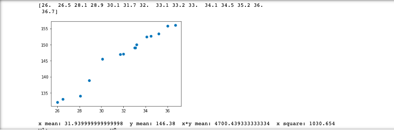
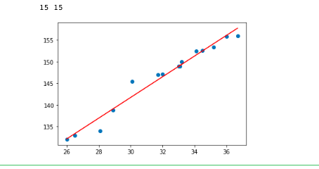
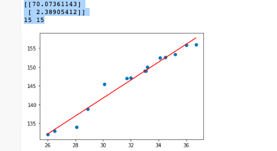

==================
Assignment3
==================

Linear Regression::

    In this assignment you will implement and use the probabilistic linear regression model in python. Y
    ou are expected to implement this yourself without use of other libraries other than the ones imported below.
    You can collaborate online by uploading the notebook to https://colab.research.google.com/.
    Consider the following dataset that shows the price t of 15 different studios in the city according to their size X

    import numpy as np
    import matplotlib.pyplot as plt
    from scipy.stats import norm

    N = 15

    t = np.reshape(np.array([132.1,133.0,134.0,138.8,145.5,147.0,147.1,149.0,150.0,149.0,152.4,152.6, 153.4, 155.8, 156.0]), (N,1))
    X = np.array([[1,26.0],[1,26.5],[1,28.1],[1,28.9],[1,30.1],[1,31.7],[1,32.0],[1,33.1],[1,33.2],[1,33.0],[1,34.1],[1,34.5],
            [1,35.2],[1,36.0],[1,36.7]], np.float)

Question1::

    [2 Points] Plot the data and argue if a linear model is a good choice given the data.

    Calculating w0 and w1 using square loss function where f(x)=w0+w1x Square loss function is
    sl=(tn-f(Xn;w0,w1))^2 w0=mean(Y)-w1mean(X) w1=(mean(XY)-mean(X)mean(Y))/(mean(X*2)-mean(X)**2)
    Here the linear model is good choice since the target (price) is linearly distributed over variable(X-area).

Solution::

    x=X[:, 1]
    print(x)
    y=t[:, 0]
    plt.scatter(x, y)
    plt.show()

    y_mean=np.mean(y)
    x_mean=np.mean(x)
    xy_mean=np.mean(x*y)
    x_POW2= np.mean(x**2)
    print('x mean:',x_mean,' y mean:',y_mean,' x*y mean:',xy_mean,' x square:',x_POW2)
    w1=(xy_mean-x_mean*y_mean)/(x_POW2-x_mean**2)
    w0=(y_mean-w1*x_mean)
    print('w1:    ','              w0   ')
    print(w1,w0)

    OUT:
    [26.  26.5  28.1  28.9  30.1  31.7 32. 33.1  33.2  33.  34.1  34.5  35.2  36.  36.7]

Argument for linear::

    There are very few point which are out of scope of the linear line.Which described below.
    Which clearly shows that the prdiction of target over the variable is almost lies on straight line.
    Making predictions using linear regression

    def plot_data(w0,w1,x,y):
    Y_pred = w0 + w1*x
    plt.scatter(x, y)
    print(len(x),len(y))
    plt.plot(x, Y_pred, color='red')  # regression line
    plt.show()

    plot_data(w0,w1,x,y)

Approach2 for linear using Matrix::

    using matrix calculation finding lenear equation variable w0 and w1. Formula: w = (XTX)^-1 XTt

    As below: w = (X_transposeX_matrix)^-1 *(X_transposet)

    X_Transpose=X.transpose()
    xTx = np.matmul(X_Transpose, X)
    xTx_inv=np.linalg.inv(xTx)
    xTx_inv_XT = np.matmul(xTx_inv,X_Transpose)
    w=np.matmul(xTx_inv_XT,t)
    print(w)
    w0=w[0][0]
    w1=w[1][0]
    plot_data(w0,w1,x,y)

    OUT:
    [[70.07361143]
     [2.38905412]]
      15 15

Question2::

    [2 Points] Obtain a probabilistic regression model based on a likelihood function to describe this dataset.
    Compute the model parameters.

Solution::

    Calculating model parameter(sigma aquare and w )using maximum likelihood function.
    optimum w = (XTX)^−1(XTt)
            σ^2 =(1/N)(t-Xw)^T(t-Xw)

    x_mul_w=np.matmul(X, w)

    t_sub_X_mul_w=np.subtract(t, x_mul_w)

    t_sub_X_mul_w_T=t_sub_X_mul_w.transpose()

    sigma_square=(np.matmul(t_sub_X_mul_w_T,t_sub_X_mul_w))/N

    print('w=',w)
    print('σ^2=',sigma_square)

    OUT:
    w=  [[70.07361143]
        [ 2.38905412]]

    σ^2= [[1.96947379]]

Question3::

    2 Points] Use the model to estimate the price of a studio of size  32.5 .
    How certain are you about the estimation (i.e., what is the variance of the estimation)?

Solution::

    Formula: t = wTx + ε tnew = w^T*xnew

    Varience of the estimation var{tnew }= σ^2 xnew^T (X^T X)−1 xnew

    wT = w.transpose()
    print(wT)
    xnew=np.reshape(np.array([1,32.5]), (2,1))
    tnew=np.matmul(wT,xnew)
    print('price of flat studio 32.5=',tnew[0][0])

    xnewT=xnew.transpose()
    result1=np.matmul(xnewT,xTx_inv)
    result2=np.matmul(result1,xnew)
    varience=np.matmul(sigma_square,result2)
    print('Varience=',varience[0][0])

    #The variecnce of estimation is 0.1352 which is low since its lies between training data set.
    OUT:
    [[70.07361143  2.38905412]]
     price of flat studio 32.5= 147.717870306822
     Varience= 0.1352232822519466

Question4::

    Points] Use the model to estimate the price of a studio of size  60 , and the respective uncertainty (variance).
    What do you observe?

Solution::

    #Here the varience is getting increase more as we go further away from the training data set.
    xnew=np.reshape(np.array([1,60]), (2,1))
    tnew=np.matmul(wT,xnew)
    print('price of flat studio 60 =',tnew[0][0])
    xnewT=xnew.transpose()
    result1=np.matmul(xnewT,xTx_inv)
    result2=np.matmul(result1,xnew)
    varience=np.matmul(sigma_square,result2)
    print('Varience =',varience[0][0])

    OUT:
    price of flat studio 60 = 213.41685858817033
    Varience = 9.985971551077636

    Observation: The varience is getting increase, when we are predicting data out away from the training data set.
    The traing data set range is [26.0 to 36.7] checking price at point 60 which is away from 36.7.

Question5::

    [2 Points] Use the model to estimate the price of a studio of size  10 , and the respective uncertainty (variance).
     What do you observe?

Solution::

    #Here the varience is getting increase go further away from the training data set.
    xnew=np.reshape(np.array([1,10]), (2,1))
    tnew=np.matmul(wT,xnew)
    print('price of flat studio 10 =',tnew[0][0])
    xnewT=xnew.transpose()
    result1=np.matmul(xnewT,xTx_inv)
    result2=np.matmul(result1,xnew)
    varience=np.matmul(sigma_square,result2)
    print('Varience =',varience[0][0])

    OUT:
     price of flat studio 10 = 93.96415262208242
     Varience = 6.1560637049933185

     Observation:
     The varience is getting increase, when we are predicting data out away from the training data set.
     The traing data set range is.[26.0 to 36.7] checking price at point 10 which is less than 26.
     But compare to above variance it is less since the out of scope is comaratively leass than above.
     Conclusion: The varience is directely proportional to the training data set range.
     Where its will increse more when we deviate more from the traing data set.