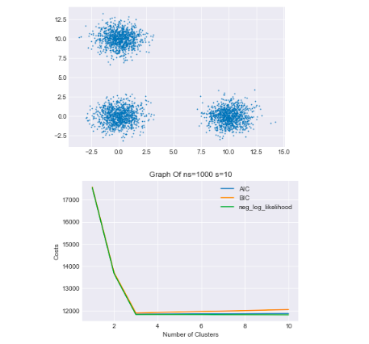
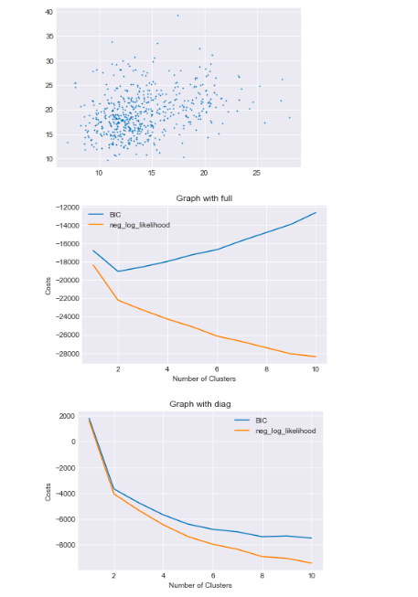

==================
Assignment4
==================

Lab 4::

    GMMS, AIC and BIC
    The goal of this assignment is to investigate the application of AIC and BIC for
    identifying the correct number of clusters in a Gaussian Mixture Model (GMM).
    You are expected to use mixture from sklearn but you should implement the AIC and BIC
    scores yourself without the use of the AIC and BIC scores from gmm.

    import numpy as np
    import matplotlib.pyplot as plt
    from sklearn import mixture

# A. Instructions::

    We first generate datasets of three clusters, i.e. a mixture of three Gaussians will be the true groundtruth.
    We require a separation parameter  𝑠  which will specify how far the three Gaussians (clusters) will be from
    each other. In addition, we require another parameter  𝑛𝑠  that identifies the number of samples (data points)
    for each Gaussian.

    We generate the three Gaussian clusters (i.e., the groundtruth) as following:

    # generate spherical data
    def generate_spherical_data(ns,s):
        data1 = np.random.randn(ns, 2)
        data2 = np.random.randn(ns, 2) + np.array([s, 0])
        data3 = np.random.randn(ns, 2) + np.array([0, s])
        # concatenate
        data = np.vstack([data1,data2,data3])
        return data

Instruction1::

    III. We can cluster the dataset using GMM from sklearn, where K specifies the number of clusters to be estimated
    from the data. n_init determines the number of repititions for optimizing the log-likelihood function.

Solution::

    data=generate_spherical_data(100,10)
    # You may plot the data to see how it looks like
    plt.scatter(data[:, 0], data[:, 1], .8)
    plt.show()
    K = 5
    gmm = mixture.GaussianMixture(n_components=K, n_init=10)
    gmm.fit(data)

Instruction2::

    IV. Note that you may modify the default input parameters of GaussianMixture() to obtain a better estimation.
    For example, n_init is in default set to 1, but you can set a larger number to obtain the best likelihood among
    several trials (e.g. n_init = 10).

    The total log-likelihood from gmm is obtained by:  𝑁∗𝑔𝑚𝑚.𝑠𝑐𝑜𝑟𝑒(𝑑𝑎𝑡𝑎)  where  𝑁  is the total number of objects
    (data points). Note that in this assignment, you should obtain AIC and BIC using the formulas described
    in the lecture. You may not use the computed AIC and BIC scores by the gmm class (the results might be different).

Solution::

    #To calculate AIC BIC and LOG_Likelihood clusture
    #AICK =−log p(X|.)+ cK
    #BICK =−log p(X|.)+1/2(cK*log N)
    #cK =K·D+(K−1)+K·D·(D+1)/2.======> This is for full co varience matrix
    #K=estimated cluster=5
    #D=Number of dimension of data=2 use lib to calculate

    def calculate_optimum_cluster(data_point):
        shape=data_point.shape
        N=shape[0]
        D=shape[1]
        AICs=[]
        BICs=[]
        neg_log_lhs=[]
        K_cluster = [1, 2, 3, 4, 5, 6, 7, 8, 9, 10]
        for K in K_cluster:
            gmm = mixture.GaussianMixture(n_components=K, n_init=10)
            gmm.fit(data_point)
            log_lh = N*gmm.score(data_point)
            ck = K*D+(K-1)+(K*D*(D+1))/2
            AIC = ck-log_lh
            BIC = ck*np.log(N)/2-log_lh
            AICs.append(AIC)
            BICs.append(BIC)
            neg_log_lhs.append(-1*log_lh)
        return neg_log_lhs, AICs, BICs

# Questions

Question1::

    [2 Points] Describe a procedure for estimating the correct number of clusters via AIC and BIC.

Solution::

    #The graph it shows that the optimal cluster possible based on AIC BIC and neg log likelihood is 3.
    #The procedure to estimate the correct number of cluster is using AIC BIC and Likelihood using graph where the all
    # three line get converge.

    def plot_graph(neg_log_lhs,AICs,BICs,graph_name):
        plt.style.use('seaborn-darkgrid')
        plt.figure();
        ax1= plt.subplot(111)
        if AICs is not None:
            ax1.plot(range(1, 11), AICs, label='AIC')
        if BICs is not None:
            ax1.plot(range(1, 11), BICs, label='BIC')
        if neg_log_lhs is not None:
            ax1.plot(range(1, 11), neg_log_lhs, label='neg_log_likelihood')
        plt.title(graph_name)
        plt.xlabel('Number of Clusters')
        plt.ylabel('Costs')
        ax1.legend()
        plt.show()

    lh,aic,bic = calculate_optimum_cluster(data)

    plot_graph(lh,aic,bic,'Graph Of ns=100 s=10')

Question2::

    [3 Points] Assume that we estimate the full covariance matrices for each of the Gaussians.
        a. Apply AIC and BIC to estimate the number of clusters when the groundtruth data is generated with
            s = 10 and ns = 10, 1000 (you perform the experiments twice, first with ns = 10 and then with ns = 1000 ).
        b. Report the results and discuss your observations.

Solution ns=10 s=10::

    # Data set with  ns=10 s=10  Experiment1
    data_10_10=generate_spherical_data(10,10)
    # You may plot the data to see how it looks like
    plt.scatter(data_10_10[:, 0], data_10_10[:, 1], .8)
    plt.show()
    log_lhs,aic,bic = calculate_optimum_cluster(data_10_10)
    plot_graph(log_lhs,aic,bic,'Graph Of ns=10 s=10')

Solution ns=1000 s=10::

    # Data set with ns=1000 and s=10 Experiment2
    data_1000_10=generate_spherical_data(1000,10)
    # You may plot the data to see how it looks like
    plt.scatter(data_1000_10[:, 0], data_1000_10[:, 1], .8)
    plt.show()
    log_lhs,aic,bic = calculate_optimum_cluster(data_1000_10)
    plot_graph(log_lhs,aic,bic,'Graph Of ns=1000 s=10')

Observation::

    AIC is an estimate of a constant plus the relative distance between the unknown true likelihood function of
    the data and the fitted likelihood function of the model, so that a lower AIC means a model is considered to
    be closer to the truth. BIC is an estimate of a function of the posterior probability of a model being true,
    under a certain Bayesian setup, so that a lower BIC means that a model is considered to be more likely
    to be the true model. The above model with n=10 and ns=10 the AIC and BIC is not coming as the lower point since
    it is continuously decreaseing as the number of cluster increase so its deficult to decide the optimal cluster.
    But as the number of data point increase the optimal cluster generation become more realistic and close
    to the model truth.

    Observation:Based on above two experiment its clearly show that , With more data set the model is
    close to the truth(likelihood) which shows with 1000 data(Here AIC BIC and likelihood is getting merge to
    the lowest point 3).But if the data set is very few then model truth is not close which shows in
    data set 10(The AIC BIC and likelihood not getting merge to any cluster point).

Question3::

    [2 Points] Set  𝑠  = 10 and  𝑛𝑠=500 . Assume that you know the covariance matrices are diagonal but not
    necessarily the same. Then, how would you apply AIC and BIC? Show/plot the results.

Solution::

    # For known covarience type which is diagonal need to pass covariance_type='diag' as parameter.
    # Number of free parameter for know covarience matrix with diagonal is 2*K*D+(K-1)
    # ck = diagonal(K*D)+mean(K*D)+ pi(K-1) = 2*K*D + (K-1)
    def calculate_AIC_BIC_LogLikeligood_diagonal_covarience_matrix(data_point):
        shape=data_point.shape
        N=shape[0]
        D=shape[1]
        AICs=[]
        BICs=[]
        neg_log_lhs=[]
        K_cluster = [1, 2, 3, 4, 5, 6, 7, 8, 9, 10]
        for K in K_cluster:
            gmm = mixture.GaussianMixture(n_components=K,covariance_type='diag', n_init=10)
            gmm.fit(data_point)
            log_lh = N*gmm.score(data_point)
            mean = K*D
            pi= K-1
            ck = K*D+mean+pi
            AIC = ck-log_lh
            BIC = ck*np.log(N)/2-log_lh
            AICs.append(AIC)
            BICs.append(BIC)
            neg_log_lhs.append(-1*log_lh)
        return neg_log_lhs, AICs, BICs

    ns = 500
    s = 10
    data_500_10=generate_spherical_data(500,10)
    # You may plot the data to see how it looks like
    plt.scatter(data_500_10[:, 0], data_500_10[:, 1], .8)
    plt.show()

    log_lhs,aic,bic = calculate_AIC_BIC_LogLikeligood_diagonal_covarience_matrix(data_1000_10)
    plot_graph(log_lhs,aic,bic,'Graph Of ns=500 s=10 covariance matrices are diagonal')

    OUT:

Question4::

    [3 Points] Apply BIC to analyze the number of clusters for a real-world dataset called breast_cancer.
        The information about the dataset can be found at:
        https://scikit-learn.org/stable/modules/generated/sklearn.datasets.load_breast_cancer.html#sklearn.datasets.load_breast_cancer
        a. Investigate BIC for finding the number of clusters where you assume
            i) you estimate all the covariance matrices separately,
            ii) you estimate all the full covariance matrices separately, but assume that they are diagonal.
        b. Plot the BIC and the negative log-likelihood results for each case.
        c. Which assumption would you choose at the end? Discuss your answer.

Solution::

    def calculate_BIC_log_likelihood(data_point,varience):
    shape=data_point.shape
    N=shape[0]
    D=shape[1]
    BICs=[]
    neg_log_lhs=[]
    K_cluster = [1, 2, 3, 4, 5, 6, 7, 8, 9, 10]
    for K in K_cluster:
        if varience == 'diag':
            gmm = mixture.GaussianMixture(n_components=K,covariance_type='diag', n_init=10)
            gmm.fit(data_point)
            log_lh = N*gmm.score(data_point)
            ck = 2*K*D+K-1 # for diagonal covarience matrix
        if varience == 'full':
            gmm = mixture.GaussianMixture(n_components=K,covariance_type='full', n_init=10)
            gmm.fit(data_point)
            log_lh = N*gmm.score(data_point)
            ck = K*D+(K-1)+(K*D*(D+1))/2 # For Full covarience matrix

        BIC = ck*np.log(N)/2-log_lh
        BICs.append(BIC)
        neg_log_lhs.append(-1*log_lh)
    return BICs,neg_log_lhs

    from sklearn.datasets import load_breast_cancer
    data = load_breast_cancer().data
    plt.scatter(data[:, 0], data[:, 1], .8)
    plt.show()
    BIC,neg_log_like=calculate_BIC_log_likelihood(data,'full')
    plot_graph(neg_log_like,None,BIC,'Graph with full')

    BIC,neg_log_like=calculate_BIC_log_likelihood(data,'diag')
    plot_graph(neg_log_like,None,BIC,'Graph with diag')

    OUT:

Observation::

    Which assumption would you choose at the end?
    The second assumption as (full covariance matrices separately, but assume that they are diagonal ) is best fit .
    BIC is an estimate of a function of the posterior probability of a model being true, under a certain Bayesian
    setup, so that a lower BIC means that a model is considered to be more likely to be the true model.
    Here in the second assumption the BIC is the lowest one which says the more likely to be the true assumption.
    The above data point the number of clusture more in diagonal(cluster=10) sice BIC is lower than with full(cluster=2)