======================
India Temperature
======================

DataSet::

    import pandas as pd
    import matplotlib.pyplot as plt  # basic plotting library
    import seaborn as sns  # additional plotting functions
    import scipy
    import scipy.stats as stats
    import numpy as np

    plt.style.use('seaborn-darkgrid')  # nicer looking plots
    url = 'https://raw.githubusercontent.com/ramashanker/dataset/master/climate/India/India_Temp_IMD_2017.csv'
    data = pd.read_csv(url)
    result=pd.concat([data.head(4), data.tail(4)])
    result

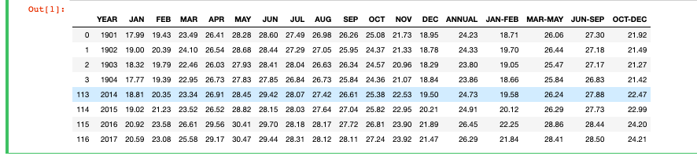

Scatter Plot::

    def scatter_plot(x,y):
    plt.figure(figsize=(32, 4));
    ax1 = plt.subplot(121)
    plt.scatter(x, y)
    plt.show()
    scatter_plot(data['YEAR'],data['ANNUAL'])

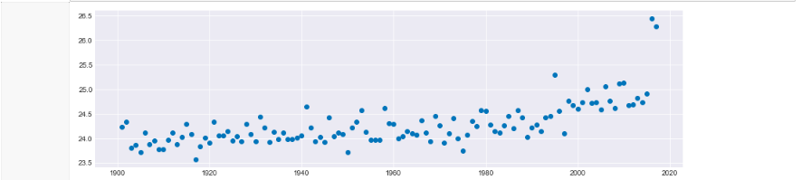

Annual Temperature data::

    #Plotting yearly temperature:
    x=data['YEAR']
    y=data['ANNUAL']
    w0,w1=calculate_linear_equation(x,y)
    plot_data(w0,w1,x,y)
    plt.figure(figsize=(15,6))
    sns.kdeplot(x, y, shade=True);

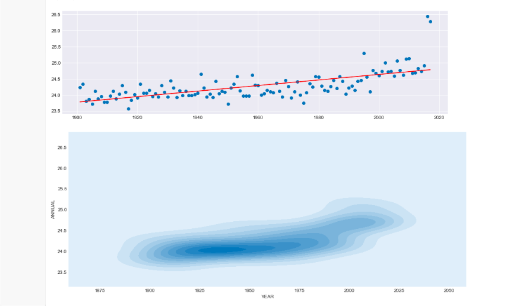

June Temp data::

    # Temprature in June month
    x=data['YEAR']
    y=data['JUN']
    w0,w1=calculate_linear_equation(x,y)
    plot_data(w0,w1,x,y)
    plt.figure(figsize=(15,6))
    sns.kdeplot(x, y, shade=True);

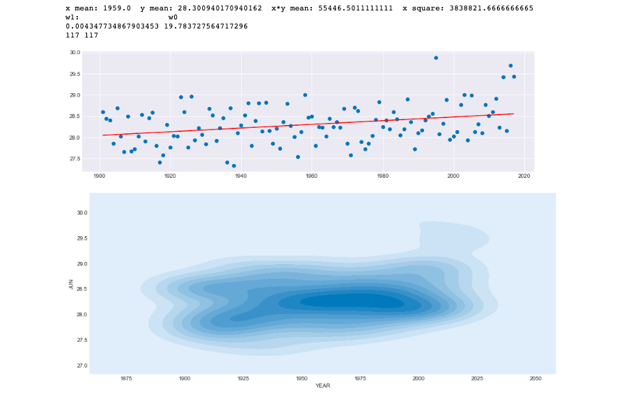

July Temp Data::

    # Temprature in July month
    x=data['YEAR']
    y=data['JUL']
    w0,w1=calculate_linear_equation(x,y)
    plot_data(w0,w1,x,y)
    plt.figure(figsize=(15,6))
    sns.kdeplot(x, y, shade=True);

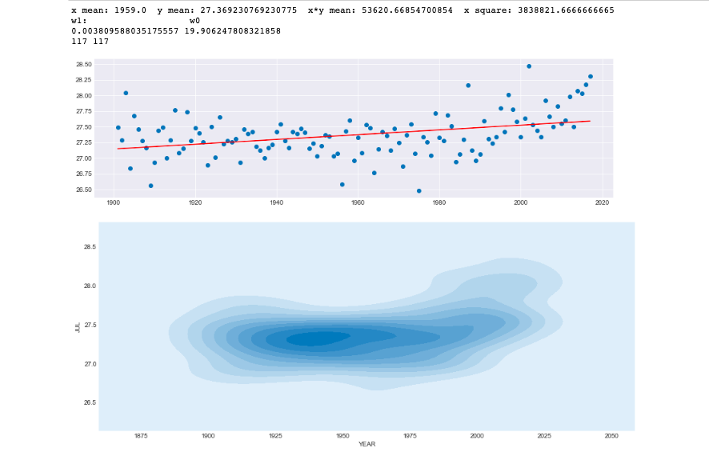

August Temp Data::

    # Temprature in August month
    x=data['YEAR']
    y=data['AUG']
    w0,w1=calculate_linear_equation(x,y)
    plot_data(w0,w1,x,y)
    plt.figure(figsize=(15,6))
    sns.kdeplot(x, y, shade=True);

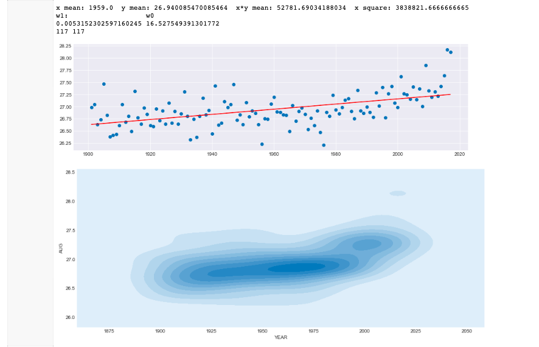

September Temp Data::

    # Temprature in September month
    x=data['YEAR']
    y=data['SEP']
    w0,w1=calculate_linear_equation(x,y)
    plot_data(w0,w1,x,y)
    plt.figure(figsize=(15,6))
    sns.kdeplot(x, y, shade=True);

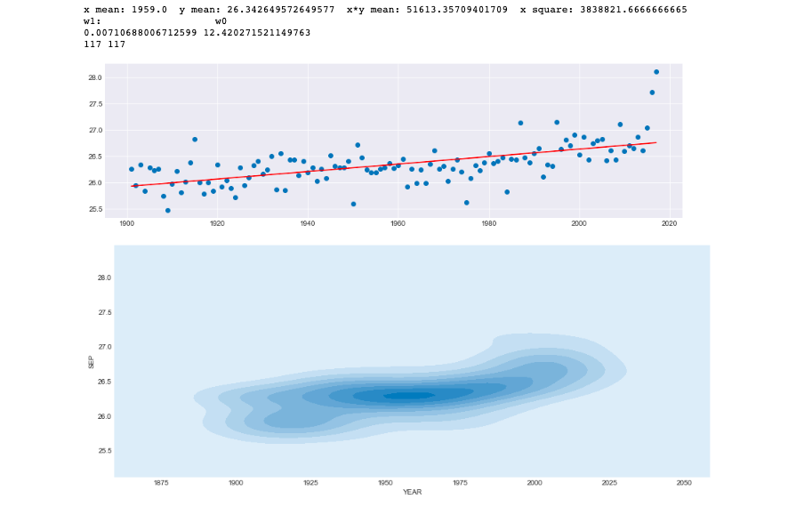

October Temp Data::

    # Temprature in October month
    x=data['YEAR']
    y=data['OCT']
    w0,w1=calculate_linear_equation(x,y)
    plot_data(w0,w1,x,y)
    plt.figure(figsize=(15,6))
    sns.kdeplot(x, y, shade=True);

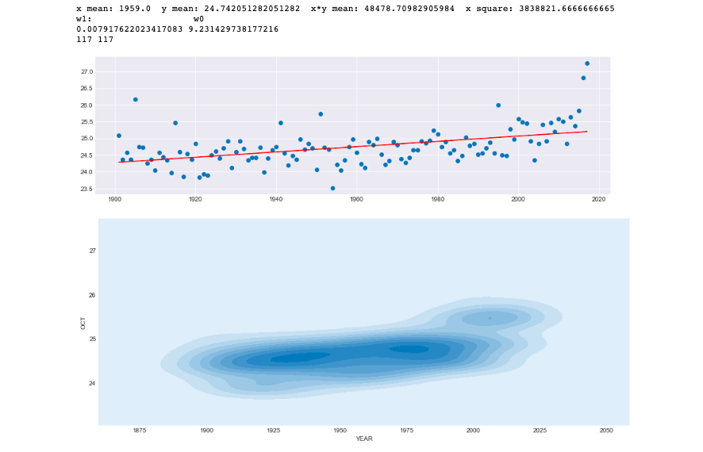

November Temp Data::

    # Temprature in November month
    x=data['YEAR']
    y=data['NOV']
    w0,w1=calculate_linear_equation(x,y)
    plot_data(w0,w1,x,y)
    plt.figure(figsize=(15,6))
    sns.kdeplot(x, y, shade=True);

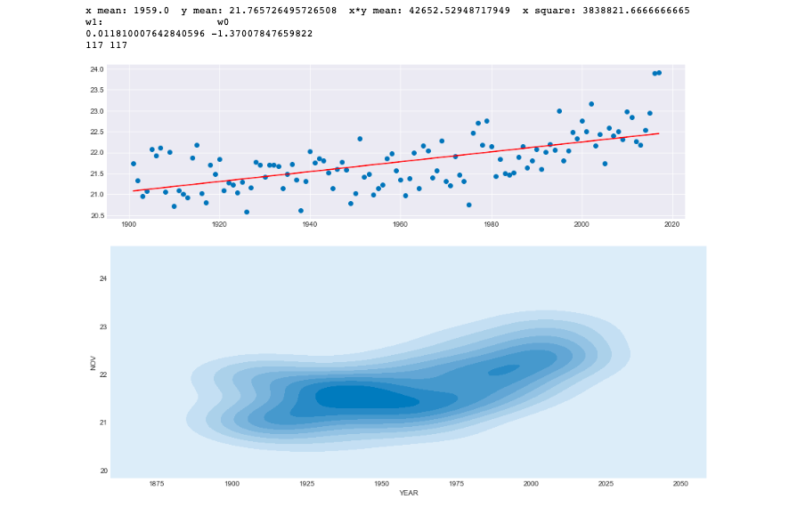

December Temp Data::

    # Temprature in December month
    x=data['YEAR']
    y=data['DEC']
    w0,w1=calculate_linear_equation(x,y)
    plot_data(w0,w1,x,y)
    plt.figure(figsize=(15,6))
    sns.kdeplot(x, y, shade=True);

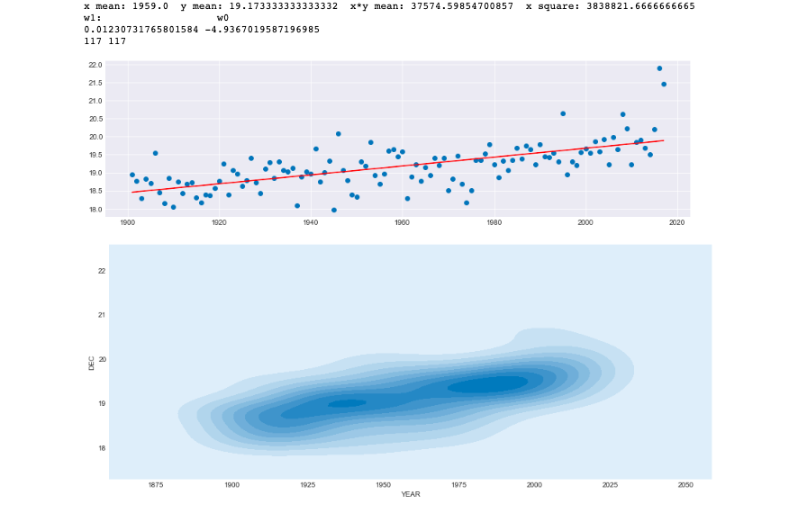

January Temp Data::

    # Temprature in January month
    x=data['YEAR']
    y=data['JAN']
    w0,w1=calculate_linear_equation(x,y)
    plot_data(w0,w1,x,y)
    plt.figure(figsize=(15,6))
    sns.kdeplot(x, y, shade=True);

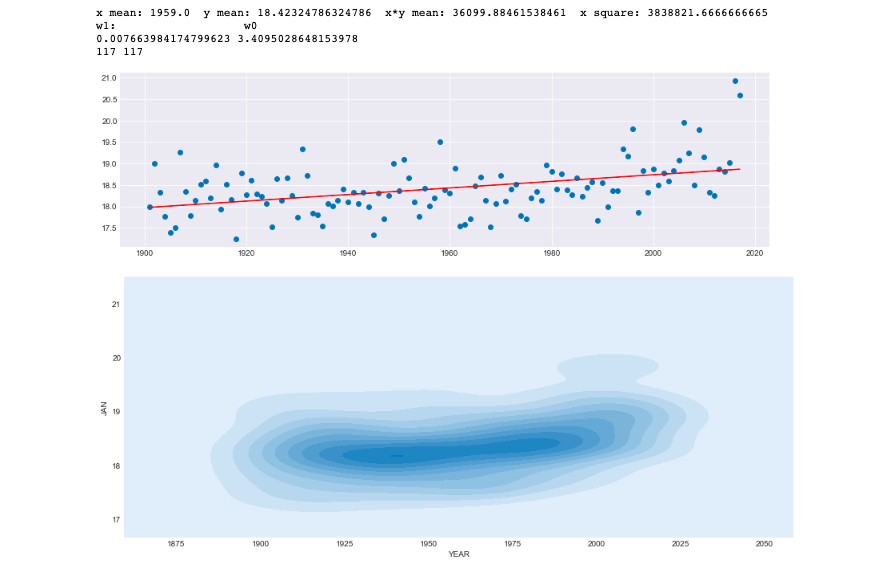

February Temp Data::

    # Temprature in February month
    x=data['YEAR']
    y=data['FEB']
    w0,w1=calculate_linear_equation(x,y)
    plot_data(w0,w1,x,y)
    plt.figure(figsize=(15,6))
    sns.kdeplot(x, y, shade=True);

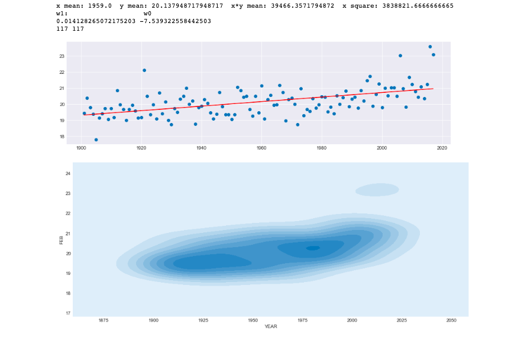

March Temp Data::

    # Temprature in March month
    x=data['YEAR']
    y=data['MAR']
    w0,w1=calculate_linear_equation(x,y)
    plot_data(w0,w1,x,y)
    plt.figure(figsize=(15,6))
    sns.kdeplot(x, y, shade=True);

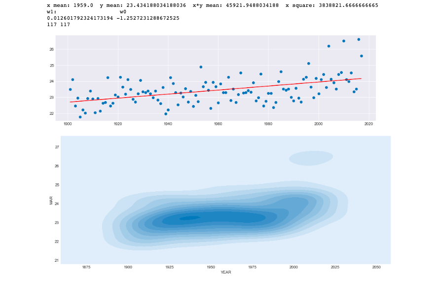

April Temp Data::

    # Temprature in April month
    x=data['YEAR']
    y=data['APR']
    w0,w1=calculate_linear_equation(x,y)
    plot_data(w0,w1,x,y)
    plt.figure(figsize=(15,6))
    sns.kdeplot(x, y, shade=True);

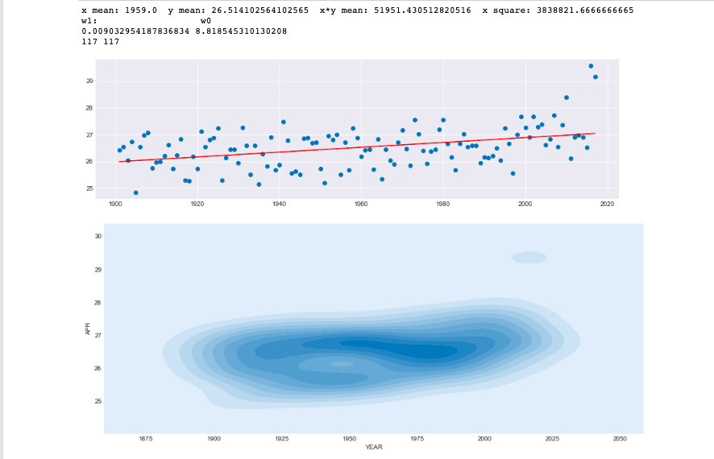