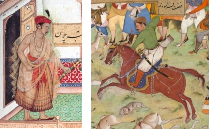
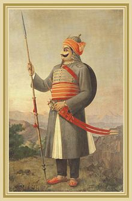

===============
Historical Fact
===============

 Akbar::

    Born: 15 October 1542
    Place: Amarkot, Rajputana
    Died: 27 October 1605 (aged 63)
    Place: Fatehpur Sikri, Agra
    Height: 5.7 feet (

 Maharan Pratap::

    Born: 9 May 1540
    Place: Kumbhalgarh, Mewar
    Died: 19 January 1597 (aged 56)
    Place: Chavand, Mewar
    Height: 7.5 feet(according to udaipur historical record)

