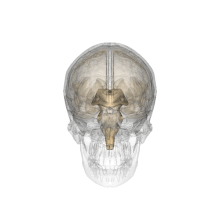

======================
Upnishad
======================

Upnishad::

    The word ‘Upanishad’ has been derived from the root Sad (to sit), to which are added two prefixes:
    Upa and Ni. The prefix Upa denotes nearness and Ni totality. Thus, this word means ‘sitting near by devotedly’.
    The Sanskrit term Upaniṣad (from upa "by" and ni-ṣad "sit down")[31] translates to "sitting down near",
    referring to the student sitting down near the teacher while receiving spiritual knowledge.(Gurumukh)
    The Upanishads are commonly referred to as Vedānta.

    According to the Muktikopanishad 108 Upanishads are divided according to four Vedas are as follows:
    10 Upanishads from the Rigveda
    19 Upanishads from the Shukla-Yajurveda
    32 Upanishads from the Krishna-Yajurveda
    16 Upanishads from the Samaveda and
    31 Upanishads from the Atharvaveda.

    The Principal thirteen Upanishads, related to the Vedas are:
    (A) Upanishads of the Rigveda :
        (1) Aitareya Upanishad,
        (2) Kaushitaki Upanishad
    (B) Upanishads of the Shukla-Yajurveda:
        (3) Brihadaranyaka Upanishad,
        (4) Isha Upanishad
    (C) Upanishads of the Krishna-Yajurveda:
        (5) Taittiriya Upanishad,
        (6) Katha Upanishad,
        (7) Shvetashvatara Upanishad,
        (8) Maitrayaniya Upanishad
    (D) Upanishads of the Samaveda:
        (9) Chandogya Upanishad,
        (10) Kena Upanishad
    (E) Upanishads of the Atharvaveda:
        (11) Mundaka Upanishad,
        (12) Mandukya Upanishad,
        (13) Prashna Upanishad.

Taittiriya Upanishad::

    ॐ सह नाववतु ।
    सह नौ भुनक्तु ।
    सह वीर्यं करवावहै ।
    तेजस्वि नावधीतमस्तु
    मा विद्विषावहै ।
    ॐ शान्तिः शान्तिः शान्तिः ॥

    Om! May it protect us both (teacher and student)!
    May both be nourished
    May both work together with great energy
    May both intelect be sharpened (may our study be effective)
    Let there be no Animosity amongst both of us
    Om, peace (in me), peace (in nature), peace (in divine forces)

Mandukya Upnishad::

    नान्तःप्रज्ञं न बहिष्प्रज्ञं नोभयतःप्रज्ञं न प्रज्ञानघनं न प्रज्ञं नाप्रज्ञम्‌।
    अदृष्टमव्यवहार्यमग्राह्यमलक्षणमचिन्त्यमव्यपदेश्यमेकात्मप्रत्ययसारं प्रपञ्चोपशमं
    शान्तं शिवमद्वैतं चतुर्थं मन्यन्ते स आत्मा स विज्ञेयः ॥

    breaking:
    न अन्तःप्रज्ञम्। न वहिःप्रज्ञम्। न उभयतःप्रज्ञम्। न प्रज्ञानधनम्। न प्रज्ञम्।
    न अप्रज्ञम्। अदृष्टम् अव्यवहार्यम् अग्राह्यम् अलक्षणम् अचिन्त्यम् अव्यपदेश्यम् एकात्मप्रत्यसारं
    प्रपञ्चोपशमम् शान्तं शिवम् अद्वैतं चतुर्थं मन्यन्ते विवेकिनः । सः आत्मा सः विज्ञेयः ॥
    Hindi:
    वह न अन्तःप्रज्ञ है न बहिष्प्रज्ञ है, न उभय-प्रज्ञ अर्थात् अन्तः एवं बहिष्प्रज्ञ एक साथ है, न वह प्रज्ञान-घन है,
    न प्रज्ञ (ज्ञाता) है, न अप्रज्ञ (अज्ञाता)। वह जो अदृष्ट है, अव्यवहार्य है, अग्राह्य है, अलक्षण है, अचिन्त्य है,
    अव्यपदेश्य अर्थात् अनिर्देश्य है, 'आत्मा' के ऐकान्तिक अस्तित्व का बोध ही जिसका सार है, 'जिसमें' समस्त प्रपञ्चात्मक
    जगत् का विलय हो जाता है, जो 'पूर्ण शान्त' है, जो 'शिवम्' है-मंगलकारी है, और जो 'अद्वैत' है,
    'उसे' ही चतुर्थ (पाद) माना जाता है; 'वही' है 'आत्मा', एकमात्र 'वही' 'विज्ञेय' (जानने योग्य तत्त्व) है।
    Four States:
    1) अन्तःप्रज्ञम्।---dreaming state---inward wise
    2) बहिःप्रज्ञं-----waking state------outward wise
    3) प्रज्ञानघनं----deep spleeping----wisdom self gathered
    4) तुरीय ------pure consciousness

    pineal gland(third eye)--The pineal gland produces melatonin, a serotonin-derived hormone which modulates
    sleep patterns in both circadian and seasonal cycles

    circadian cycle:
    melatonin tablet: same harmone produce by pineal glands melatonin, a serotonin-derived hormone
    sleeping cycle: awake state,dream state, deep sleep(you dont know who you are,you are out from your
    body),Turiya(state)
    Turiya:---pineal gland is used to reach for turiya

.. image:: ../images/upnishad/pineal_use.jpg
   :height: 400px
   :width:  400 px
   :scale: 100 %